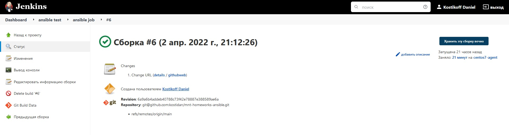
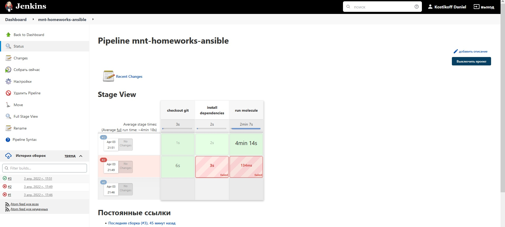
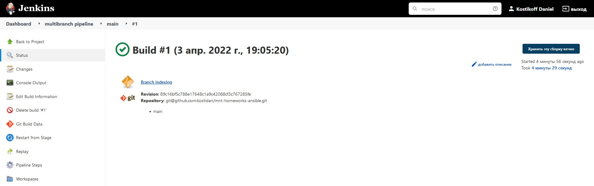
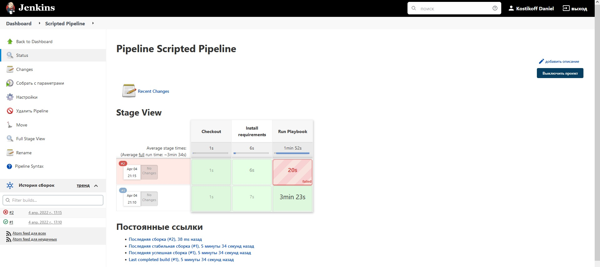

# Домашнее задание к занятию "09.04 Jenkins"

## Основная часть

1. Сделать Freestyle Job, который будет запускать `molecule test` из любого вашего репозитория с ролью.

- <details><summary>Скриншот</summary>

    

</details>

- <details><summary>Лог</summary>

    ```
    01:12:26 Started by user Kostikoff Daniel
    01:12:26 Running as SYSTEM
    01:12:26 Building remotely on centos7-agent (custom centos ansible docker) in workspace /opt/jenkins_agent/workspace/ansible test/ansible job
    01:12:26 The recommended git tool is: NONE
    01:12:26 using credential 23920420-e23b-464e-ba4a-bdc56cec9944
    01:12:26  > git rev-parse --resolve-git-dir /opt/jenkins_agent/workspace/ansible test/ansible job/mnt-homeworks-ansible/.git # timeout=10
    01:12:26 Fetching changes from the remote Git repository
    01:12:26  > git config remote.origin.url git@github.com:kostidan/mnt-homeworks-ansible.git # timeout=10
    01:12:26 Fetching upstream changes from git@github.com:kostidan/mnt-homeworks-ansible.git
    01:12:26  > git --version # timeout=10
    01:12:26  > git --version # 'git version 1.8.3.1'
    01:12:26 using GIT_SSH to set credentials 
    01:12:26 [INFO] Currently running in a labeled security context
    01:12:26 [INFO] Currently SELinux is 'enforcing' on the host
    01:12:26  > /usr/bin/chcon --type=ssh_home_t /opt/jenkins_agent/workspace/ansible test/ansible job/mnt-homeworks-ansible@tmp/jenkins-gitclient-ssh1455687940998607810.key
    01:12:26  > git fetch --tags --progress git@github.com:kostidan/mnt-homeworks-ansible.git +refs/heads/*:refs/remotes/origin/* # timeout=10
    01:12:28  > git rev-parse refs/remotes/origin/main^{commit} # timeout=10
    01:12:28 Checking out Revision 6a9a6b4addeb40788c73f42e78887e388589ae6a (refs/remotes/origin/main)
    01:12:28  > git config core.sparsecheckout # timeout=10
    01:12:28  > git checkout -f 6a9a6b4addeb40788c73f42e78887e388589ae6a # timeout=10
    01:12:28 Commit message: "Change URL"
    01:12:28  > git rev-list --no-walk 492ad25cf02417f483a274e8371b78592da298a4 # timeout=10
    01:12:28 [ansible job] $ /bin/sh -xe /tmp/jenkins8751476583354195314.sh
    01:12:28 + cd mnt-homeworks-ansible
    01:12:28 + pip3 install -r test-requirements.txt
    01:12:28 Defaulting to user installation because normal site-packages is not writeable
    01:12:28 Requirement already satisfied: molecule==3.4.0 in /home/jenkins/.local/lib/python3.6/site-packages (from -r test-requirements.txt (line 1)) (3.4.0)
    01:12:28 Requirement already satisfied: molecule_docker in /home/jenkins/.local/lib/python3.6/site-packages (from -r test-requirements.txt (line 2)) (1.1.0)
    01:12:28 Requirement already satisfied: docker in /home/jenkins/.local/lib/python3.6/site-packages (from -r test-requirements.txt (line 3)) (5.0.3)
    01:12:28 Requirement already satisfied: ansible-lint in /home/jenkins/.local/lib/python3.6/site-packages (from -r test-requirements.txt (line 4)) (5.4.0)
    01:12:28 Requirement already satisfied: yamllint in /home/jenkins/.local/lib/python3.6/site-packages (from -r test-requirements.txt (line 5)) (1.26.3)
    01:12:28 Requirement already satisfied: click<9,>=8.0 in /home/jenkins/.local/lib/python3.6/site-packages (from molecule==3.4.0->-r test-requirements.txt (line 1)) (8.0.4)
    01:12:28 Requirement already satisfied: paramiko<3,>=2.5.0 in /home/jenkins/.local/lib/python3.6/site-packages (from molecule==3.4.0->-r test-requirements.txt (line 1)) (2.10.3)
    01:12:28 Requirement already satisfied: rich>=9.5.1 in /home/jenkins/.local/lib/python3.6/site-packages (from molecule==3.4.0->-r test-requirements.txt (line 1)) (12.0.1)
    01:12:28 Requirement already satisfied: selinux in /usr/local/lib/python3.6/site-packages (from molecule==3.4.0->-r test-requirements.txt (line 1)) (0.2.1)
    01:12:28 Requirement already satisfied: click-help-colors>=0.9 in /home/jenkins/.local/lib/python3.6/site-packages (from molecule==3.4.0->-r test-requirements.txt (line 1)) (0.9.1)
    01:12:28 Requirement already satisfied: enrich>=1.2.5 in /home/jenkins/.local/lib/python3.6/site-packages (from molecule==3.4.0->-r test-requirements.txt (line 1)) (1.2.7)
    01:12:28 Requirement already satisfied: subprocess-tee>=0.3.2 in /home/jenkins/.local/lib/python3.6/site-packages (from molecule==3.4.0->-r test-requirements.txt (line 1)) (0.3.5)
    01:12:28 Requirement already satisfied: dataclasses in /home/jenkins/.local/lib/python3.6/site-packages (from molecule==3.4.0->-r test-requirements.txt (line 1)) (0.8)
    01:12:28 Requirement already satisfied: Jinja2>=2.11.3 in /usr/local/lib/python3.6/site-packages (from molecule==3.4.0->-r test-requirements.txt (line 1)) (3.0.3)
    01:12:28 Requirement already satisfied: setuptools>=42 in /usr/local/lib/python3.6/site-packages (from molecule==3.4.0->-r test-requirements.txt (line 1)) (59.6.0)
    01:12:28 Requirement already satisfied: PyYAML<6,>=5.1 in /home/jenkins/.local/lib/python3.6/site-packages (from molecule==3.4.0->-r test-requirements.txt (line 1)) (5.4.1)
    01:12:28 Requirement already satisfied: cookiecutter>=1.7.3 in /home/jenkins/.local/lib/python3.6/site-packages (from molecule==3.4.0->-r test-requirements.txt (line 1)) (1.7.3)
    01:12:28 Requirement already satisfied: packaging in /usr/local/lib/python3.6/site-packages (from molecule==3.4.0->-r test-requirements.txt (line 1)) (21.3)
    01:12:28 Requirement already satisfied: pluggy<1.0,>=0.7.1 in /home/jenkins/.local/lib/python3.6/site-packages (from molecule==3.4.0->-r test-requirements.txt (line 1)) (0.13.1)
    01:12:28 Requirement already satisfied: cerberus!=1.3.3,!=1.3.4,>=1.3.1 in /home/jenkins/.local/lib/python3.6/site-packages (from molecule==3.4.0->-r test-requirements.txt (line 1)) (1.3.2)
    01:12:28 Requirement already satisfied: requests in /home/jenkins/.local/lib/python3.6/site-packages (from molecule_docker->-r test-requirements.txt (line 2)) (2.27.1)
    01:12:28 Requirement already satisfied: ansible-compat>=0.5.0 in /home/jenkins/.local/lib/python3.6/site-packages (from molecule_docker->-r test-requirements.txt (line 2)) (1.0.0)
    01:12:28 Requirement already satisfied: websocket-client>=0.32.0 in /home/jenkins/.local/lib/python3.6/site-packages (from docker->-r test-requirements.txt (line 3)) (1.3.1)
    01:12:28 Requirement already satisfied: wcmatch>=7.0 in /home/jenkins/.local/lib/python3.6/site-packages (from ansible-lint->-r test-requirements.txt (line 4)) (8.3)
    01:12:28 Requirement already satisfied: tenacity in /home/jenkins/.local/lib/python3.6/site-packages (from ansible-lint->-r test-requirements.txt (line 4)) (8.0.1)
    01:12:28 Requirement already satisfied: typing-extensions in /home/jenkins/.local/lib/python3.6/site-packages (from ansible-lint->-r test-requirements.txt (line 4)) (4.1.1)
    01:12:28 Requirement already satisfied: ruamel.yaml<1,>=0.15.34 in /home/jenkins/.local/lib/python3.6/site-packages (from ansible-lint->-r test-requirements.txt (line 4)) (0.17.21)
    01:12:28 Requirement already satisfied: pathspec>=0.5.3 in /home/jenkins/.local/lib/python3.6/site-packages (from yamllint->-r test-requirements.txt (line 5)) (0.9.0)
    01:12:28 Requirement already satisfied: cached-property~=1.5 in /home/jenkins/.local/lib/python3.6/site-packages (from ansible-compat>=0.5.0->molecule_docker->-r test-requirements.txt (line 2)) (1.5.2)
    01:12:28 Requirement already satisfied: importlib-metadata in /home/jenkins/.local/lib/python3.6/site-packages (from click<9,>=8.0->molecule==3.4.0->-r test-requirements.txt (line 1)) (4.8.3)
    01:12:28 Requirement already satisfied: jinja2-time>=0.2.0 in /home/jenkins/.local/lib/python3.6/site-packages (from cookiecutter>=1.7.3->molecule==3.4.0->-r test-requirements.txt (line 1)) (0.2.0)
    01:12:28 Requirement already satisfied: six>=1.10 in /home/jenkins/.local/lib/python3.6/site-packages (from cookiecutter>=1.7.3->molecule==3.4.0->-r test-requirements.txt (line 1)) (1.16.0)
    01:12:28 Requirement already satisfied: binaryornot>=0.4.4 in /home/jenkins/.local/lib/python3.6/site-packages (from cookiecutter>=1.7.3->molecule==3.4.0->-r test-requirements.txt (line 1)) (0.4.4)
    01:12:28 Requirement already satisfied: poyo>=0.5.0 in /home/jenkins/.local/lib/python3.6/site-packages (from cookiecutter>=1.7.3->molecule==3.4.0->-r test-requirements.txt (line 1)) (0.5.0)
    01:12:28 Requirement already satisfied: python-slugify>=4.0.0 in /home/jenkins/.local/lib/python3.6/site-packages (from cookiecutter>=1.7.3->molecule==3.4.0->-r test-requirements.txt (line 1)) (6.1.1)
    01:12:28 Requirement already satisfied: MarkupSafe>=2.0 in /usr/local/lib64/python3.6/site-packages (from Jinja2>=2.11.3->molecule==3.4.0->-r test-requirements.txt (line 1)) (2.0.1)
    01:12:28 Requirement already satisfied: cryptography>=2.5 in /usr/local/lib64/python3.6/site-packages (from paramiko<3,>=2.5.0->molecule==3.4.0->-r test-requirements.txt (line 1)) (36.0.2)
    01:12:28 Requirement already satisfied: bcrypt>=3.1.3 in /home/jenkins/.local/lib/python3.6/site-packages (from paramiko<3,>=2.5.0->molecule==3.4.0->-r test-requirements.txt (line 1)) (3.2.0)
    01:12:28 Requirement already satisfied: pynacl>=1.0.1 in /home/jenkins/.local/lib/python3.6/site-packages (from paramiko<3,>=2.5.0->molecule==3.4.0->-r test-requirements.txt (line 1)) (1.5.0)
    01:12:28 Requirement already satisfied: certifi>=2017.4.17 in /home/jenkins/.local/lib/python3.6/site-packages (from requests->molecule_docker->-r test-requirements.txt (line 2)) (2021.10.8)
    01:12:28 Requirement already satisfied: charset-normalizer~=2.0.0 in /home/jenkins/.local/lib/python3.6/site-packages (from requests->molecule_docker->-r test-requirements.txt (line 2)) (2.0.12)
    01:12:28 Requirement already satisfied: urllib3<1.27,>=1.21.1 in /home/jenkins/.local/lib/python3.6/site-packages (from requests->molecule_docker->-r test-requirements.txt (line 2)) (1.26.9)
    01:12:28 Requirement already satisfied: idna<4,>=2.5 in /home/jenkins/.local/lib/python3.6/site-packages (from requests->molecule_docker->-r test-requirements.txt (line 2)) (3.3)
    01:12:28 Requirement already satisfied: commonmark<0.10.0,>=0.9.0 in /home/jenkins/.local/lib/python3.6/site-packages (from rich>=9.5.1->molecule==3.4.0->-r test-requirements.txt (line 1)) (0.9.1)
    01:12:28 Requirement already satisfied: pygments<3.0.0,>=2.6.0 in /home/jenkins/.local/lib/python3.6/site-packages (from rich>=9.5.1->molecule==3.4.0->-r test-requirements.txt (line 1)) (2.11.2)
    01:12:28 Requirement already satisfied: ruamel.yaml.clib>=0.2.6 in /home/jenkins/.local/lib/python3.6/site-packages (from ruamel.yaml<1,>=0.15.34->ansible-lint->-r test-requirements.txt (line 4)) (0.2.6)
    01:12:28 Requirement already satisfied: bracex>=2.1.1 in /home/jenkins/.local/lib/python3.6/site-packages (from wcmatch>=7.0->ansible-lint->-r test-requirements.txt (line 4)) (2.2.1)
    01:12:28 Requirement already satisfied: pyparsing!=3.0.5,>=2.0.2 in /usr/local/lib/python3.6/site-packages (from packaging->molecule==3.4.0->-r test-requirements.txt (line 1)) (3.0.7)
    01:12:28 Requirement already satisfied: distro>=1.3.0 in /usr/local/lib/python3.6/site-packages (from selinux->molecule==3.4.0->-r test-requirements.txt (line 1)) (1.7.0)
    01:12:28 Requirement already satisfied: cffi>=1.1 in /usr/local/lib64/python3.6/site-packages (from bcrypt>=3.1.3->paramiko<3,>=2.5.0->molecule==3.4.0->-r test-requirements.txt (line 1)) (1.15.0)
    01:12:28 Requirement already satisfied: chardet>=3.0.2 in /home/jenkins/.local/lib/python3.6/site-packages (from binaryornot>=0.4.4->cookiecutter>=1.7.3->molecule==3.4.0->-r test-requirements.txt (line 1)) (4.0.0)
    01:12:28 Requirement already satisfied: zipp>=0.5 in /home/jenkins/.local/lib/python3.6/site-packages (from importlib-metadata->click<9,>=8.0->molecule==3.4.0->-r test-requirements.txt (line 1)) (3.6.0)
    01:12:28 Requirement already satisfied: arrow in /home/jenkins/.local/lib/python3.6/site-packages (from jinja2-time>=0.2.0->cookiecutter>=1.7.3->molecule==3.4.0->-r test-requirements.txt (line 1)) (1.2.2)
    01:12:28 Requirement already satisfied: text-unidecode>=1.3 in /home/jenkins/.local/lib/python3.6/site-packages (from python-slugify>=4.0.0->cookiecutter>=1.7.3->molecule==3.4.0->-r test-requirements.txt (line 1)) (1.3)
    01:12:28 Requirement already satisfied: pycparser in /usr/local/lib/python3.6/site-packages (from cffi>=1.1->bcrypt>=3.1.3->paramiko<3,>=2.5.0->molecule==3.4.0->-r test-requirements.txt (line 1)) (2.21)
    01:12:28 Requirement already satisfied: python-dateutil>=2.7.0 in /home/jenkins/.local/lib/python3.6/site-packages (from arrow->jinja2-time>=0.2.0->cookiecutter>=1.7.3->molecule==3.4.0->-r test-requirements.txt (line 1)) (2.8.2)
    01:12:29 + molecule test
    01:12:29 INFO     default scenario test matrix: dependency, lint, cleanup, destroy, syntax, create, prepare, converge, idempotence, side_effect, verify, cleanup, destroy
    01:12:29 INFO     Performing prerun...
    01:12:29 INFO     Guessed /opt/jenkins_agent/workspace/ansible test/ansible job/mnt-homeworks-ansible as project root directory
    01:12:29 WARNING  Computed fully qualified role name of elasticsearch_role does not follow current galaxy requirements.
    01:12:29 Please edit meta/main.yml and assure we can correctly determine full role name:
    01:12:29 
    01:12:29 galaxy_info:
    01:12:29 role_name: my_name  # if absent directory name hosting role is used instead
    01:12:29 namespace: my_galaxy_namespace  # if absent, author is used instead
    01:12:29 
    01:12:29 Namespace: https://galaxy.ansible.com/docs/contributing/namespaces.html#galaxy-namespace-limitations
    01:12:29 Role: https://galaxy.ansible.com/docs/contributing/creating_role.html#role-names
    01:12:29 
    01:12:29 As an alternative, you can add 'role-name' to either skip_list or warn_list.
    01:12:29 
    01:12:29 INFO     Using /home/jenkins/.cache/ansible-lint/6873e6/roles/elasticsearch_role symlink to current repository in order to enable Ansible to find the role using its expected full name.
    01:12:30 INFO     Added ANSIBLE_ROLES_PATH=~/.ansible/roles:/usr/share/ansible/roles:/etc/ansible/roles:/home/jenkins/.cache/ansible-lint/6873e6/roles
    01:12:30 INFO     Running default > dependency
    01:12:31 WARNING  Skipping, missing the requirements file.
    01:12:31 WARNING  Skipping, missing the requirements file.
    01:12:31 INFO     Running default > lint
    01:12:31 INFO     Lint is disabled.
    01:12:31 INFO     Running default > cleanup
    01:12:31 WARNING  Skipping, cleanup playbook not configured.
    01:12:31 INFO     Running default > destroy
    01:12:31 INFO     Sanity checks: 'docker'
    01:12:32 
    01:12:32 PLAY [Destroy] *****************************************************************
    01:12:32 
    01:12:32 TASK [Destroy molecule instance(s)] ********************************************
    01:12:33 changed: [localhost] => (item=centos7)
    01:12:33 changed: [localhost] => (item=ubuntu)
    01:12:33 
    01:12:33 TASK [Wait for instance(s) deletion to complete] *******************************
    01:12:34 ok: [localhost] => (item=centos7)
    01:12:34 ok: [localhost] => (item=ubuntu)
    01:12:34 
    01:12:34 TASK [Delete docker networks(s)] ***********************************************
    01:12:35 
    01:12:35 PLAY RECAP *********************************************************************
    01:12:35 localhost                  : ok=2    changed=1    unreachable=0    failed=0    skipped=1    rescued=0    ignored=0
    01:12:35 
    01:12:35 INFO     Running default > syntax
    01:12:35 
    01:12:35 playbook: /opt/jenkins_agent/workspace/ansible test/ansible job/mnt-homeworks-ansible/molecule/default/converge.yml
    01:12:35 INFO     Running default > create
    01:12:36 
    01:12:36 PLAY [Create] ******************************************************************
    01:12:36 
    01:12:36 TASK [Log into a Docker registry] **********************************************
    01:12:36 skipping: [localhost] => (item=None)
    01:12:36 skipping: [localhost] => (item=None)
    01:12:36 skipping: [localhost]
    01:12:36 
    01:12:36 TASK [Check presence of custom Dockerfiles] ************************************
    01:12:37 ok: [localhost] => (item={'image': 'docker.io/pycontribs/centos:7', 'name': 'centos7', 'pre_build_image': True})
    01:12:37 ok: [localhost] => (item={'image': 'docker.io/pycontribs/ubuntu:latest', 'name': 'ubuntu', 'pre_build_image': True})
    01:12:37 
    01:12:37 TASK [Create Dockerfiles from image names] *************************************
    01:12:37 skipping: [localhost] => (item={'image': 'docker.io/pycontribs/centos:7', 'name': 'centos7', 'pre_build_image': True})
    01:12:37 skipping: [localhost] => (item={'image': 'docker.io/pycontribs/ubuntu:latest', 'name': 'ubuntu', 'pre_build_image': True})
    01:12:37 
    01:12:37 TASK [Discover local Docker images] ********************************************
    01:12:38 ok: [localhost] => (item={'changed': False, 'skipped': True, 'skip_reason': 'Conditional result was False', 'item': {'image': 'docker.io/pycontribs/centos:7', 'name': 'centos7', 'pre_build_image': True}, 'ansible_loop_var': 'item', 'i': 0, 'ansible_index_var': 'i'})
    01:12:38 ok: [localhost] => (item={'changed': False, 'skipped': True, 'skip_reason': 'Conditional result was False', 'item': {'image': 'docker.io/pycontribs/ubuntu:latest', 'name': 'ubuntu', 'pre_build_image': True}, 'ansible_loop_var': 'item', 'i': 1, 'ansible_index_var': 'i'})
    01:12:38 
    01:12:38 TASK [Build an Ansible compatible image (new)] *********************************
    01:12:38 skipping: [localhost] => (item=molecule_local/docker.io/pycontribs/centos:7)
    01:12:38 skipping: [localhost] => (item=molecule_local/docker.io/pycontribs/ubuntu:latest)
    01:12:38 
    01:12:38 TASK [Create docker network(s)] ************************************************
    01:12:39 
    01:12:39 TASK [Determine the CMD directives] ********************************************
    01:12:39 ok: [localhost] => (item={'image': 'docker.io/pycontribs/centos:7', 'name': 'centos7', 'pre_build_image': True})
    01:12:39 ok: [localhost] => (item={'image': 'docker.io/pycontribs/ubuntu:latest', 'name': 'ubuntu', 'pre_build_image': True})
    01:12:39 
    01:12:39 TASK [Create molecule instance(s)] *********************************************
    01:12:40 changed: [localhost] => (item=centos7)
    01:12:40 changed: [localhost] => (item=ubuntu)
    01:12:40 
    01:12:40 TASK [Wait for instance(s) creation to complete] *******************************
    01:12:41 FAILED - RETRYING: Wait for instance(s) creation to complete (300 retries left).
    01:12:46 changed: [localhost] => (item={'started': 1, 'finished': 0, 'ansible_job_id': '670838635986.26964', 'results_file': '/home/jenkins/.ansible_async/670838635986.26964', 'changed': True, 'failed': False, 'item': {'image': 'docker.io/pycontribs/centos:7', 'name': 'centos7', 'pre_build_image': True}, 'ansible_loop_var': 'item'})
    01:12:47 changed: [localhost] => (item={'started': 1, 'finished': 0, 'ansible_job_id': '911478750797.26993', 'results_file': '/home/jenkins/.ansible_async/911478750797.26993', 'changed': True, 'failed': False, 'item': {'image': 'docker.io/pycontribs/ubuntu:latest', 'name': 'ubuntu', 'pre_build_image': True}, 'ansible_loop_var': 'item'})
    01:12:47 
    01:12:47 PLAY RECAP *********************************************************************
    01:12:47 localhost                  : ok=5    changed=2    unreachable=0    failed=0    skipped=4    rescued=0    ignored=0
    01:12:47 
    01:12:47 INFO     Running default > prepare
    01:12:47 WARNING  Skipping, prepare playbook not configured.
    01:12:47 INFO     Running default > converge
    01:12:47 
    01:12:47 PLAY [Converge] ****************************************************************
    01:12:47 
    01:12:47 TASK [Gathering Facts] *********************************************************
    01:12:50 ok: [ubuntu]
    01:12:53 ok: [centos7]
    01:12:53 
    01:12:53 TASK [Include mnt-homeworks-ansible] *******************************************
    01:12:53 
    01:12:53 TASK [mnt-homeworks-ansible : Fail if unsupported system detected] *************
    01:12:53 skipping: [centos7]
    01:12:53 skipping: [ubuntu]
    01:12:53 
    01:12:53 TASK [mnt-homeworks-ansible : Check files directory exists] ********************
    01:12:54 ok: [centos7 -> localhost]
    01:12:54 
    01:12:54 TASK [mnt-homeworks-ansible : include_tasks] ***********************************
    01:12:54 included: /opt/jenkins_agent/workspace/ansible test/ansible job/mnt-homeworks-ansible/tasks/download_yum.yml for centos7
    01:12:54 included: /opt/jenkins_agent/workspace/ansible test/ansible job/mnt-homeworks-ansible/tasks/download_apt.yml for ubuntu
    01:12:54 
    01:12:54 TASK [mnt-homeworks-ansible : Download Elasticsearch's rpm] ********************
    01:17:45 changed: [centos7 -> localhost]
    01:17:45 
    01:17:45 TASK [mnt-homeworks-ansible : Copy Elasticsearch to managed node] **************
    01:17:52 changed: [centos7]
    01:17:52 
    01:17:52 TASK [mnt-homeworks-ansible : Download Elasticsearch's deb] ********************
    01:22:52 changed: [ubuntu -> localhost]
    01:22:52 
    01:22:52 TASK [mnt-homeworks-ansible : Copy Elasticsearch to manage host] ***************
    01:22:57 changed: [ubuntu]
    01:22:57 
    01:22:57 TASK [mnt-homeworks-ansible : include_tasks] ***********************************
    01:22:57 included: /opt/jenkins_agent/workspace/ansible test/ansible job/mnt-homeworks-ansible/tasks/install_yum.yml for centos7
    01:22:57 included: /opt/jenkins_agent/workspace/ansible test/ansible job/mnt-homeworks-ansible/tasks/install_apt.yml for ubuntu
    01:22:57 
    01:22:57 TASK [mnt-homeworks-ansible : Install Elasticsearch] ***************************
    01:23:18 changed: [centos7]
    01:23:18 
    01:23:18 TASK [mnt-homeworks-ansible : Install Elasticsearch] ***************************
    01:23:38 changed: [ubuntu]
    01:23:38 
    01:23:38 TASK [mnt-homeworks-ansible : Configure Elasticsearch] *************************
    01:23:40 changed: [centos7]
    01:23:41 changed: [ubuntu]
    01:23:41 
    01:23:41 RUNNING HANDLER [mnt-homeworks-ansible : restart Elasticsearch] ****************
    01:23:41 skipping: [centos7]
    01:23:41 skipping: [ubuntu]
    01:23:41 
    01:23:41 PLAY RECAP *********************************************************************
    01:23:41 centos7                    : ok=8    changed=4    unreachable=0    failed=0    skipped=2    rescued=0    ignored=0
    01:23:41 ubuntu                     : ok=7    changed=4    unreachable=0    failed=0    skipped=2    rescued=0    ignored=0
    01:23:41 
    01:23:41 INFO     Running default > idempotence
    01:23:43 
    01:23:43 PLAY [Converge] ****************************************************************
    01:23:43 
    01:23:43 TASK [Gathering Facts] *********************************************************
    01:23:45 ok: [ubuntu]
    01:23:49 ok: [centos7]
    01:23:49 
    01:23:49 TASK [Include mnt-homeworks-ansible] *******************************************
    01:23:49 
    01:23:49 TASK [mnt-homeworks-ansible : Fail if unsupported system detected] *************
    01:23:50 skipping: [centos7]
    01:23:50 skipping: [ubuntu]
    01:23:50 
    01:23:50 TASK [mnt-homeworks-ansible : Check files directory exists] ********************
    01:23:50 ok: [centos7 -> localhost]
    01:23:50 
    01:23:50 TASK [mnt-homeworks-ansible : include_tasks] ***********************************
    01:23:50 included: /opt/jenkins_agent/workspace/ansible test/ansible job/mnt-homeworks-ansible/tasks/download_yum.yml for centos7
    01:23:50 included: /opt/jenkins_agent/workspace/ansible test/ansible job/mnt-homeworks-ansible/tasks/download_apt.yml for ubuntu
    01:23:50 
    01:23:50 TASK [mnt-homeworks-ansible : Download Elasticsearch's rpm] ********************
    01:28:42 ok: [centos7 -> localhost]
    01:28:42 
    01:28:42 TASK [mnt-homeworks-ansible : Copy Elasticsearch to managed node] **************
    01:28:44 ok: [centos7]
    01:28:44 
    01:28:44 TASK [mnt-homeworks-ansible : Download Elasticsearch's deb] ********************
    01:33:37 ok: [ubuntu -> localhost]
    01:33:37 
    01:33:37 TASK [mnt-homeworks-ansible : Copy Elasticsearch to manage host] ***************
    01:33:39 ok: [ubuntu]
    01:33:39 
    01:33:39 TASK [mnt-homeworks-ansible : include_tasks] ***********************************
    01:33:39 included: /opt/jenkins_agent/workspace/ansible test/ansible job/mnt-homeworks-ansible/tasks/install_yum.yml for centos7
    01:33:39 included: /opt/jenkins_agent/workspace/ansible test/ansible job/mnt-homeworks-ansible/tasks/install_apt.yml for ubuntu
    01:33:39 
    01:33:39 TASK [mnt-homeworks-ansible : Install Elasticsearch] ***************************
    01:33:41 ok: [centos7]
    01:33:41 
    01:33:41 TASK [mnt-homeworks-ansible : Install Elasticsearch] ***************************
    01:33:46 ok: [ubuntu]
    01:33:46 
    01:33:46 TASK [mnt-homeworks-ansible : Configure Elasticsearch] *************************
    01:33:48 ok: [centos7]
    01:33:48 ok: [ubuntu]
    01:33:48 
    01:33:48 PLAY RECAP *********************************************************************
    01:33:48 centos7                    : ok=8    changed=0    unreachable=0    failed=0    skipped=1    rescued=0    ignored=0
    01:33:48 ubuntu                     : ok=7    changed=0    unreachable=0    failed=0    skipped=1    rescued=0    ignored=0
    01:33:48 
    01:33:48 INFO     Idempotence completed successfully.
    01:33:48 INFO     Running default > side_effect
    01:33:48 WARNING  Skipping, side effect playbook not configured.
    01:33:48 INFO     Running default > verify
    01:33:48 INFO     Running Ansible Verifier
    01:33:49 
    01:33:49 PLAY [Verify] ******************************************************************
    01:33:49 
    01:33:49 TASK [Example assertion] *******************************************************
    01:33:49 ok: [centos7] => {
    01:33:49     "changed": false,
    01:33:49     "msg": "All assertions passed"
    01:33:49 }
    01:33:49 ok: [ubuntu] => {
    01:33:49     "changed": false,
    01:33:49     "msg": "All assertions passed"
    01:33:49 }
    01:33:49 
    01:33:49 PLAY RECAP *********************************************************************
    01:33:49 centos7                    : ok=1    changed=0    unreachable=0    failed=0    skipped=0    rescued=0    ignored=0
    01:33:49 ubuntu                     : ok=1    changed=0    unreachable=0    failed=0    skipped=0    rescued=0    ignored=0
    01:33:49 
    01:33:49 INFO     Verifier completed successfully.
    01:33:49 INFO     Running default > cleanup
    01:33:49 WARNING  Skipping, cleanup playbook not configured.
    01:33:49 INFO     Running default > destroy
    01:33:50 
    01:33:50 PLAY [Destroy] *****************************************************************
    01:33:50 
    01:33:50 TASK [Destroy molecule instance(s)] ********************************************
    01:33:51 changed: [localhost] => (item=centos7)
    01:33:51 changed: [localhost] => (item=ubuntu)
    01:33:51 
    01:33:51 TASK [Wait for instance(s) deletion to complete] *******************************
    01:33:52 FAILED - RETRYING: Wait for instance(s) deletion to complete (300 retries left).
    01:33:57 changed: [localhost] => (item=centos7)
    01:33:58 changed: [localhost] => (item=ubuntu)
    01:33:58 
    01:33:58 TASK [Delete docker networks(s)] ***********************************************
    01:33:58 
    01:33:58 PLAY RECAP *********************************************************************
    01:33:58 localhost                  : ok=2    changed=2    unreachable=0    failed=0    skipped=1    rescued=0    ignored=0
    01:33:58 
    01:33:58 INFO     Pruning extra files from scenario ephemeral directory
    01:33:58 Finished: SUCCESS
    ```
</details>

2. Сделать Declarative Pipeline Job, который будет запускать `molecule test` из любого вашего репозитория с ролью.

- <details><summary>Скриншот</summary>

    

</details>

- <details><summary>Скрипт</summary>

    ```
    pipeline {
        agent{
            label 'ansible'
        }
        stages{
            stage('checkout git'){
                steps{
                    git branch: 'main', credentialsId: '23920420-e23b-464e-ba4a-bdc56cec9944', url: 'git@github.com:kostidan/mnt-homeworks-ansible.git'
                }
            }
            stage('install dependencies'){
                steps{
                    sh 'pip3 install -r test-requirements.txt'
                }
            }
            stage('run molecule'){
                steps{
                    sh 'molecule test'
                }
            }
        }
    }
    ```
</details>

- <details><summary>Лог</summary>

    ```
    Started by user Kostikoff Daniel
    [Pipeline] Start of Pipeline
    [Pipeline] node
    Running on centos7-agent in /opt/jenkins_agent/workspace/mnt-homeworks-ansible
    [Pipeline] {
    [Pipeline] stage
    [Pipeline] { (checkout git)
    [Pipeline] git
    The recommended git tool is: NONE
    using credential 23920420-e23b-464e-ba4a-bdc56cec9944
    Fetching changes from the remote Git repository
    > git rev-parse --resolve-git-dir /opt/jenkins_agent/workspace/mnt-homeworks-ansible/.git # timeout=10
    > git config remote.origin.url git@github.com:kostidan/mnt-homeworks-ansible.git # timeout=10
    Fetching upstream changes from git@github.com:kostidan/mnt-homeworks-ansible.git
    > git --version # timeout=10
    > git --version # 'git version 1.8.3.1'
    using GIT_SSH to set credentials 
    [INFO] Currently running in a labeled security context
    [INFO] Currently SELinux is 'enforcing' on the host
    > /usr/bin/chcon --type=ssh_home_t /opt/jenkins_agent/workspace/mnt-homeworks-ansible@tmp/jenkins-gitclient-ssh6985847007357986961.key
    > git fetch --tags --progress git@github.com:kostidan/mnt-homeworks-ansible.git +refs/heads/*:refs/remotes/origin/* # timeout=10
    Checking out Revision e9599641b5ed26b48608bcb4f30a4c754feaf38f (refs/remotes/origin/main)
    Commit message: "change url"
    > git rev-parse refs/remotes/origin/main^{commit} # timeout=10
    > git config core.sparsecheckout # timeout=10
    > git checkout -f e9599641b5ed26b48608bcb4f30a4c754feaf38f # timeout=10
    > git branch -a -v --no-abbrev # timeout=10
    > git branch -D main # timeout=10
    > git checkout -b main e9599641b5ed26b48608bcb4f30a4c754feaf38f # timeout=10
    > git rev-list --no-walk e9599641b5ed26b48608bcb4f30a4c754feaf38f # timeout=10
    [Pipeline] }
    [Pipeline] // stage
    [Pipeline] stage
    [Pipeline] { (install dependencies)
    [Pipeline] sh
    + pip3 install -r test-requirements.txt
    Defaulting to user installation because normal site-packages is not writeable
    Requirement already satisfied: molecule==3.4.0 in /home/jenkins/.local/lib/python3.6/site-packages (from -r test-requirements.txt (line 1)) (3.4.0)
    Requirement already satisfied: molecule_docker in /home/jenkins/.local/lib/python3.6/site-packages (from -r test-requirements.txt (line 2)) (1.1.0)
    Requirement already satisfied: docker in /home/jenkins/.local/lib/python3.6/site-packages (from -r test-requirements.txt (line 3)) (5.0.3)
    Requirement already satisfied: ansible-lint in /home/jenkins/.local/lib/python3.6/site-packages (from -r test-requirements.txt (line 4)) (5.4.0)
    Requirement already satisfied: yamllint in /home/jenkins/.local/lib/python3.6/site-packages (from -r test-requirements.txt (line 5)) (1.26.3)
    Requirement already satisfied: subprocess-tee>=0.3.2 in /home/jenkins/.local/lib/python3.6/site-packages (from molecule==3.4.0->-r test-requirements.txt (line 1)) (0.3.5)
    Requirement already satisfied: cookiecutter>=1.7.3 in /home/jenkins/.local/lib/python3.6/site-packages (from molecule==3.4.0->-r test-requirements.txt (line 1)) (1.7.3)
    Requirement already satisfied: setuptools>=42 in /usr/local/lib/python3.6/site-packages (from molecule==3.4.0->-r test-requirements.txt (line 1)) (59.6.0)
    Requirement already satisfied: cerberus!=1.3.3,!=1.3.4,>=1.3.1 in /home/jenkins/.local/lib/python3.6/site-packages (from molecule==3.4.0->-r test-requirements.txt (line 1)) (1.3.2)
    Requirement already satisfied: packaging in /usr/local/lib/python3.6/site-packages (from molecule==3.4.0->-r test-requirements.txt (line 1)) (21.3)
    Requirement already satisfied: PyYAML<6,>=5.1 in /home/jenkins/.local/lib/python3.6/site-packages (from molecule==3.4.0->-r test-requirements.txt (line 1)) (5.4.1)
    Requirement already satisfied: rich>=9.5.1 in /home/jenkins/.local/lib/python3.6/site-packages (from molecule==3.4.0->-r test-requirements.txt (line 1)) (12.0.1)
    Requirement already satisfied: dataclasses in /home/jenkins/.local/lib/python3.6/site-packages (from molecule==3.4.0->-r test-requirements.txt (line 1)) (0.8)
    Requirement already satisfied: pluggy<1.0,>=0.7.1 in /home/jenkins/.local/lib/python3.6/site-packages (from molecule==3.4.0->-r test-requirements.txt (line 1)) (0.13.1)
    Requirement already satisfied: enrich>=1.2.5 in /home/jenkins/.local/lib/python3.6/site-packages (from molecule==3.4.0->-r test-requirements.txt (line 1)) (1.2.7)
    Requirement already satisfied: paramiko<3,>=2.5.0 in /home/jenkins/.local/lib/python3.6/site-packages (from molecule==3.4.0->-r test-requirements.txt (line 1)) (2.10.3)
    Requirement already satisfied: click<9,>=8.0 in /home/jenkins/.local/lib/python3.6/site-packages (from molecule==3.4.0->-r test-requirements.txt (line 1)) (8.0.4)
    Requirement already satisfied: selinux in /usr/local/lib/python3.6/site-packages (from molecule==3.4.0->-r test-requirements.txt (line 1)) (0.2.1)
    Requirement already satisfied: click-help-colors>=0.9 in /home/jenkins/.local/lib/python3.6/site-packages (from molecule==3.4.0->-r test-requirements.txt (line 1)) (0.9.1)
    Requirement already satisfied: Jinja2>=2.11.3 in /usr/local/lib/python3.6/site-packages (from molecule==3.4.0->-r test-requirements.txt (line 1)) (3.0.3)
    Requirement already satisfied: requests in /home/jenkins/.local/lib/python3.6/site-packages (from molecule_docker->-r test-requirements.txt (line 2)) (2.27.1)
    Requirement already satisfied: ansible-compat>=0.5.0 in /home/jenkins/.local/lib/python3.6/site-packages (from molecule_docker->-r test-requirements.txt (line 2)) (1.0.0)
    Requirement already satisfied: websocket-client>=0.32.0 in /home/jenkins/.local/lib/python3.6/site-packages (from docker->-r test-requirements.txt (line 3)) (1.3.1)
    Requirement already satisfied: wcmatch>=7.0 in /home/jenkins/.local/lib/python3.6/site-packages (from ansible-lint->-r test-requirements.txt (line 4)) (8.3)
    Requirement already satisfied: tenacity in /home/jenkins/.local/lib/python3.6/site-packages (from ansible-lint->-r test-requirements.txt (line 4)) (8.0.1)
    Requirement already satisfied: typing-extensions in /home/jenkins/.local/lib/python3.6/site-packages (from ansible-lint->-r test-requirements.txt (line 4)) (4.1.1)
    Requirement already satisfied: ruamel.yaml<1,>=0.15.34 in /home/jenkins/.local/lib/python3.6/site-packages (from ansible-lint->-r test-requirements.txt (line 4)) (0.17.21)
    Requirement already satisfied: pathspec>=0.5.3 in /home/jenkins/.local/lib/python3.6/site-packages (from yamllint->-r test-requirements.txt (line 5)) (0.9.0)
    Requirement already satisfied: cached-property~=1.5 in /home/jenkins/.local/lib/python3.6/site-packages (from ansible-compat>=0.5.0->molecule_docker->-r test-requirements.txt (line 2)) (1.5.2)
    Requirement already satisfied: importlib-metadata in /home/jenkins/.local/lib/python3.6/site-packages (from click<9,>=8.0->molecule==3.4.0->-r test-requirements.txt (line 1)) (4.8.3)
    Requirement already satisfied: binaryornot>=0.4.4 in /home/jenkins/.local/lib/python3.6/site-packages (from cookiecutter>=1.7.3->molecule==3.4.0->-r test-requirements.txt (line 1)) (0.4.4)
    Requirement already satisfied: jinja2-time>=0.2.0 in /home/jenkins/.local/lib/python3.6/site-packages (from cookiecutter>=1.7.3->molecule==3.4.0->-r test-requirements.txt (line 1)) (0.2.0)
    Requirement already satisfied: six>=1.10 in /home/jenkins/.local/lib/python3.6/site-packages (from cookiecutter>=1.7.3->molecule==3.4.0->-r test-requirements.txt (line 1)) (1.16.0)
    Requirement already satisfied: poyo>=0.5.0 in /home/jenkins/.local/lib/python3.6/site-packages (from cookiecutter>=1.7.3->molecule==3.4.0->-r test-requirements.txt (line 1)) (0.5.0)
    Requirement already satisfied: python-slugify>=4.0.0 in /home/jenkins/.local/lib/python3.6/site-packages (from cookiecutter>=1.7.3->molecule==3.4.0->-r test-requirements.txt (line 1)) (6.1.1)
    Requirement already satisfied: MarkupSafe>=2.0 in /usr/local/lib64/python3.6/site-packages (from Jinja2>=2.11.3->molecule==3.4.0->-r test-requirements.txt (line 1)) (2.0.1)
    Requirement already satisfied: cryptography>=2.5 in /usr/local/lib64/python3.6/site-packages (from paramiko<3,>=2.5.0->molecule==3.4.0->-r test-requirements.txt (line 1)) (36.0.2)
    Requirement already satisfied: pynacl>=1.0.1 in /home/jenkins/.local/lib/python3.6/site-packages (from paramiko<3,>=2.5.0->molecule==3.4.0->-r test-requirements.txt (line 1)) (1.5.0)
    Requirement already satisfied: bcrypt>=3.1.3 in /home/jenkins/.local/lib/python3.6/site-packages (from paramiko<3,>=2.5.0->molecule==3.4.0->-r test-requirements.txt (line 1)) (3.2.0)
    Requirement already satisfied: charset-normalizer~=2.0.0 in /home/jenkins/.local/lib/python3.6/site-packages (from requests->molecule_docker->-r test-requirements.txt (line 2)) (2.0.12)
    Requirement already satisfied: certifi>=2017.4.17 in /home/jenkins/.local/lib/python3.6/site-packages (from requests->molecule_docker->-r test-requirements.txt (line 2)) (2021.10.8)
    Requirement already satisfied: idna<4,>=2.5 in /home/jenkins/.local/lib/python3.6/site-packages (from requests->molecule_docker->-r test-requirements.txt (line 2)) (3.3)
    Requirement already satisfied: urllib3<1.27,>=1.21.1 in /home/jenkins/.local/lib/python3.6/site-packages (from requests->molecule_docker->-r test-requirements.txt (line 2)) (1.26.9)
    Requirement already satisfied: pygments<3.0.0,>=2.6.0 in /home/jenkins/.local/lib/python3.6/site-packages (from rich>=9.5.1->molecule==3.4.0->-r test-requirements.txt (line 1)) (2.11.2)
    Requirement already satisfied: commonmark<0.10.0,>=0.9.0 in /home/jenkins/.local/lib/python3.6/site-packages (from rich>=9.5.1->molecule==3.4.0->-r test-requirements.txt (line 1)) (0.9.1)
    Requirement already satisfied: ruamel.yaml.clib>=0.2.6 in /home/jenkins/.local/lib/python3.6/site-packages (from ruamel.yaml<1,>=0.15.34->ansible-lint->-r test-requirements.txt (line 4)) (0.2.6)
    Requirement already satisfied: bracex>=2.1.1 in /home/jenkins/.local/lib/python3.6/site-packages (from wcmatch>=7.0->ansible-lint->-r test-requirements.txt (line 4)) (2.2.1)
    Requirement already satisfied: pyparsing!=3.0.5,>=2.0.2 in /usr/local/lib/python3.6/site-packages (from packaging->molecule==3.4.0->-r test-requirements.txt (line 1)) (3.0.7)
    Requirement already satisfied: distro>=1.3.0 in /usr/local/lib/python3.6/site-packages (from selinux->molecule==3.4.0->-r test-requirements.txt (line 1)) (1.7.0)
    Requirement already satisfied: cffi>=1.1 in /usr/local/lib64/python3.6/site-packages (from bcrypt>=3.1.3->paramiko<3,>=2.5.0->molecule==3.4.0->-r test-requirements.txt (line 1)) (1.15.0)
    Requirement already satisfied: chardet>=3.0.2 in /home/jenkins/.local/lib/python3.6/site-packages (from binaryornot>=0.4.4->cookiecutter>=1.7.3->molecule==3.4.0->-r test-requirements.txt (line 1)) (4.0.0)
    Requirement already satisfied: zipp>=0.5 in /home/jenkins/.local/lib/python3.6/site-packages (from importlib-metadata->click<9,>=8.0->molecule==3.4.0->-r test-requirements.txt (line 1)) (3.6.0)
    Requirement already satisfied: arrow in /home/jenkins/.local/lib/python3.6/site-packages (from jinja2-time>=0.2.0->cookiecutter>=1.7.3->molecule==3.4.0->-r test-requirements.txt (line 1)) (1.2.2)
    Requirement already satisfied: text-unidecode>=1.3 in /home/jenkins/.local/lib/python3.6/site-packages (from python-slugify>=4.0.0->cookiecutter>=1.7.3->molecule==3.4.0->-r test-requirements.txt (line 1)) (1.3)
    Requirement already satisfied: pycparser in /usr/local/lib/python3.6/site-packages (from cffi>=1.1->bcrypt>=3.1.3->paramiko<3,>=2.5.0->molecule==3.4.0->-r test-requirements.txt (line 1)) (2.21)
    Requirement already satisfied: python-dateutil>=2.7.0 in /home/jenkins/.local/lib/python3.6/site-packages (from arrow->jinja2-time>=0.2.0->cookiecutter>=1.7.3->molecule==3.4.0->-r test-requirements.txt (line 1)) (2.8.2)
    [Pipeline] }
    [Pipeline] // stage
    [Pipeline] stage
    [Pipeline] { (run molecule)
    [Pipeline] sh
    + molecule test
    INFO     default scenario test matrix: dependency, lint, cleanup, destroy, syntax, create, prepare, converge, idempotence, side_effect, verify, cleanup, destroy
    INFO     Performing prerun...
    INFO     Guessed /opt/jenkins_agent/workspace/mnt-homeworks-ansible as project root directory
    WARNING  Computed fully qualified role name of elasticsearch_role does not follow current galaxy requirements.
    Please edit meta/main.yml and assure we can correctly determine full role name:

    galaxy_info:
    role_name: my_name  # if absent directory name hosting role is used instead
    namespace: my_galaxy_namespace  # if absent, author is used instead

    Namespace: https://galaxy.ansible.com/docs/contributing/namespaces.html#galaxy-namespace-limitations
    Role: https://galaxy.ansible.com/docs/contributing/creating_role.html#role-names

    As an alternative, you can add 'role-name' to either skip_list or warn_list.

    INFO     Using /home/jenkins/.cache/ansible-lint/011644/roles/elasticsearch_role symlink to current repository in order to enable Ansible to find the role using its expected full name.
    INFO     Added ANSIBLE_ROLES_PATH=~/.ansible/roles:/usr/share/ansible/roles:/etc/ansible/roles:/home/jenkins/.cache/ansible-lint/011644/roles
    INFO     Running default > dependency
    WARNING  Skipping, missing the requirements file.
    WARNING  Skipping, missing the requirements file.
    INFO     Running default > lint
    INFO     Lint is disabled.
    INFO     Running default > cleanup
    WARNING  Skipping, cleanup playbook not configured.
    INFO     Running default > destroy
    INFO     Sanity checks: 'docker'

    PLAY [Destroy] *****************************************************************

    TASK [Destroy molecule instance(s)] ********************************************
    changed: [localhost] => (item=centos7)
    changed: [localhost] => (item=ubuntu)

    TASK [Wait for instance(s) deletion to complete] *******************************
    ok: [localhost] => (item=centos7)
    ok: [localhost] => (item=ubuntu)

    TASK [Delete docker networks(s)] ***********************************************

    PLAY RECAP *********************************************************************
    localhost                  : ok=2    changed=1    unreachable=0    failed=0    skipped=1    rescued=0    ignored=0

    INFO     Running default > syntax

    playbook: /opt/jenkins_agent/workspace/mnt-homeworks-ansible/molecule/default/converge.yml
    INFO     Running default > create

    PLAY [Create] ******************************************************************

    TASK [Log into a Docker registry] **********************************************
    skipping: [localhost] => (item=None)
    skipping: [localhost] => (item=None)
    skipping: [localhost]

    TASK [Check presence of custom Dockerfiles] ************************************
    ok: [localhost] => (item={'image': 'docker.io/pycontribs/centos:7', 'name': 'centos7', 'pre_build_image': True})
    ok: [localhost] => (item={'image': 'docker.io/pycontribs/ubuntu:latest', 'name': 'ubuntu', 'pre_build_image': True})

    TASK [Create Dockerfiles from image names] *************************************
    skipping: [localhost] => (item={'image': 'docker.io/pycontribs/centos:7', 'name': 'centos7', 'pre_build_image': True})
    skipping: [localhost] => (item={'image': 'docker.io/pycontribs/ubuntu:latest', 'name': 'ubuntu', 'pre_build_image': True})

    TASK [Discover local Docker images] ********************************************
    ok: [localhost] => (item={'changed': False, 'skipped': True, 'skip_reason': 'Conditional result was False', 'item': {'image': 'docker.io/pycontribs/centos:7', 'name': 'centos7', 'pre_build_image': True}, 'ansible_loop_var': 'item', 'i': 0, 'ansible_index_var': 'i'})
    ok: [localhost] => (item={'changed': False, 'skipped': True, 'skip_reason': 'Conditional result was False', 'item': {'image': 'docker.io/pycontribs/ubuntu:latest', 'name': 'ubuntu', 'pre_build_image': True}, 'ansible_loop_var': 'item', 'i': 1, 'ansible_index_var': 'i'})

    TASK [Build an Ansible compatible image (new)] *********************************
    skipping: [localhost] => (item=molecule_local/docker.io/pycontribs/centos:7)
    skipping: [localhost] => (item=molecule_local/docker.io/pycontribs/ubuntu:latest)

    TASK [Create docker network(s)] ************************************************

    TASK [Determine the CMD directives] ********************************************
    ok: [localhost] => (item={'image': 'docker.io/pycontribs/centos:7', 'name': 'centos7', 'pre_build_image': True})
    ok: [localhost] => (item={'image': 'docker.io/pycontribs/ubuntu:latest', 'name': 'ubuntu', 'pre_build_image': True})

    TASK [Create molecule instance(s)] *********************************************
    changed: [localhost] => (item=centos7)
    changed: [localhost] => (item=ubuntu)

    TASK [Wait for instance(s) creation to complete] *******************************
    FAILED - RETRYING: Wait for instance(s) creation to complete (300 retries left).
    changed: [localhost] => (item={'started': 1, 'finished': 0, 'ansible_job_id': '576500123610.4035', 'results_file': '/home/jenkins/.ansible_async/576500123610.4035', 'changed': True, 'failed': False, 'item': {'image': 'docker.io/pycontribs/centos:7', 'name': 'centos7', 'pre_build_image': True}, 'ansible_loop_var': 'item'})
    changed: [localhost] => (item={'started': 1, 'finished': 0, 'ansible_job_id': '227981566476.4066', 'results_file': '/home/jenkins/.ansible_async/227981566476.4066', 'changed': True, 'failed': False, 'item': {'image': 'docker.io/pycontribs/ubuntu:latest', 'name': 'ubuntu', 'pre_build_image': True}, 'ansible_loop_var': 'item'})

    PLAY RECAP *********************************************************************
    localhost                  : ok=5    changed=2    unreachable=0    failed=0    skipped=4    rescued=0    ignored=0

    INFO     Running default > prepare
    WARNING  Skipping, prepare playbook not configured.
    INFO     Running default > converge

    PLAY [Converge] ****************************************************************

    TASK [Gathering Facts] *********************************************************
    ok: [ubuntu]
    ok: [centos7]

    TASK [Include mnt-homeworks-ansible] *******************************************

    TASK [mnt-homeworks-ansible : Fail if unsupported system detected] *************
    skipping: [centos7]
    skipping: [ubuntu]

    TASK [mnt-homeworks-ansible : Check files directory exists] ********************
    ok: [centos7 -> localhost]

    TASK [mnt-homeworks-ansible : include_tasks] ***********************************
    included: /opt/jenkins_agent/workspace/mnt-homeworks-ansible/tasks/download_yum.yml for centos7
    included: /opt/jenkins_agent/workspace/mnt-homeworks-ansible/tasks/download_apt.yml for ubuntu

    TASK [mnt-homeworks-ansible : Download Elasticsearch's rpm] ********************
    changed: [centos7 -> localhost]

    TASK [mnt-homeworks-ansible : Copy Elasticsearch to managed node] **************
    changed: [centos7]

    TASK [mnt-homeworks-ansible : Download Elasticsearch's deb] ********************
    changed: [ubuntu -> localhost]

    TASK [mnt-homeworks-ansible : Copy Elasticsearch to manage host] ***************
    changed: [ubuntu]

    TASK [mnt-homeworks-ansible : include_tasks] ***********************************
    included: /opt/jenkins_agent/workspace/mnt-homeworks-ansible/tasks/install_yum.yml for centos7
    included: /opt/jenkins_agent/workspace/mnt-homeworks-ansible/tasks/install_apt.yml for ubuntu

    TASK [mnt-homeworks-ansible : Install Elasticsearch] ***************************
    changed: [centos7]

    TASK [mnt-homeworks-ansible : Install Elasticsearch] ***************************
    changed: [ubuntu]

    TASK [mnt-homeworks-ansible : Configure Elasticsearch] *************************
    changed: [ubuntu]
    changed: [centos7]

    RUNNING HANDLER [mnt-homeworks-ansible : restart Elasticsearch] ****************
    skipping: [centos7]
    skipping: [ubuntu]

    PLAY RECAP *********************************************************************
    centos7                    : ok=8    changed=4    unreachable=0    failed=0    skipped=2    rescued=0    ignored=0
    ubuntu                     : ok=7    changed=4    unreachable=0    failed=0    skipped=2    rescued=0    ignored=0

    INFO     Running default > idempotence

    PLAY [Converge] ****************************************************************

    TASK [Gathering Facts] *********************************************************
    ok: [ubuntu]
    ok: [centos7]

    TASK [Include mnt-homeworks-ansible] *******************************************

    TASK [mnt-homeworks-ansible : Fail if unsupported system detected] *************
    skipping: [centos7]
    skipping: [ubuntu]

    TASK [mnt-homeworks-ansible : Check files directory exists] ********************
    ok: [centos7 -> localhost]

    TASK [mnt-homeworks-ansible : include_tasks] ***********************************
    included: /opt/jenkins_agent/workspace/mnt-homeworks-ansible/tasks/download_yum.yml for centos7
    included: /opt/jenkins_agent/workspace/mnt-homeworks-ansible/tasks/download_apt.yml for ubuntu

    TASK [mnt-homeworks-ansible : Download Elasticsearch's rpm] ********************
    ok: [centos7 -> localhost]

    TASK [mnt-homeworks-ansible : Copy Elasticsearch to managed node] **************
    ok: [centos7]

    TASK [mnt-homeworks-ansible : Download Elasticsearch's deb] ********************
    ok: [ubuntu -> localhost]

    TASK [mnt-homeworks-ansible : Copy Elasticsearch to manage host] ***************
    ok: [ubuntu]

    TASK [mnt-homeworks-ansible : include_tasks] ***********************************
    included: /opt/jenkins_agent/workspace/mnt-homeworks-ansible/tasks/install_yum.yml for centos7
    included: /opt/jenkins_agent/workspace/mnt-homeworks-ansible/tasks/install_apt.yml for ubuntu

    TASK [mnt-homeworks-ansible : Install Elasticsearch] ***************************
    ok: [centos7]

    TASK [mnt-homeworks-ansible : Install Elasticsearch] ***************************
    ok: [ubuntu]

    TASK [mnt-homeworks-ansible : Configure Elasticsearch] *************************
    ok: [centos7]
    ok: [ubuntu]

    PLAY RECAP *********************************************************************
    centos7                    : ok=8    changed=0    unreachable=0    failed=0    skipped=1    rescued=0    ignored=0
    ubuntu                     : ok=7    changed=0    unreachable=0    failed=0    skipped=1    rescued=0    ignored=0

    INFO     Idempotence completed successfully.
    INFO     Running default > side_effect
    WARNING  Skipping, side effect playbook not configured.
    INFO     Running default > verify
    INFO     Running Ansible Verifier

    PLAY [Verify] ******************************************************************

    TASK [Example assertion] *******************************************************
    ok: [centos7] => {
        "changed": false,
        "msg": "All assertions passed"
    }
    ok: [ubuntu] => {
        "changed": false,
        "msg": "All assertions passed"
    }

    PLAY RECAP *********************************************************************
    centos7                    : ok=1    changed=0    unreachable=0    failed=0    skipped=0    rescued=0    ignored=0
    ubuntu                     : ok=1    changed=0    unreachable=0    failed=0    skipped=0    rescued=0    ignored=0

    INFO     Verifier completed successfully.
    INFO     Running default > cleanup
    WARNING  Skipping, cleanup playbook not configured.
    INFO     Running default > destroy

    PLAY [Destroy] *****************************************************************

    TASK [Destroy molecule instance(s)] ********************************************
    changed: [localhost] => (item=centos7)
    changed: [localhost] => (item=ubuntu)

    TASK [Wait for instance(s) deletion to complete] *******************************
    FAILED - RETRYING: Wait for instance(s) deletion to complete (300 retries left).
    changed: [localhost] => (item=centos7)
    changed: [localhost] => (item=ubuntu)

    TASK [Delete docker networks(s)] ***********************************************

    PLAY RECAP *********************************************************************
    localhost                  : ok=2    changed=2    unreachable=0    failed=0    skipped=1    rescued=0    ignored=0

    INFO     Pruning extra files from scenario ephemeral directory
    [Pipeline] }
    [Pipeline] // stage
    [Pipeline] }
    [Pipeline] // node
    [Pipeline] End of Pipeline
    Finished: SUCCESS
    ```

3. Перенести Declarative Pipeline в репозиторий в файл `Jenkinsfile`.

    https://github.com/kostidan/mnt-homeworks-ansible/blob/main/Jenkinsfile 

4. Создать Multibranch Pipeline на запуск `Jenkinsfile` из репозитория.

- <details><summary>Скриншот</summary>

    

</details>

- <details><summary>Лог</summary>

    ```
    Branch indexing
    > git rev-parse --resolve-git-dir /var/lib/jenkins/caches/git-52f290f93dd340f389c4b9cc1acf726a/.git # timeout=10
    Setting origin to git@github.com:kostidan/mnt-homeworks-ansible.git
    > git config remote.origin.url git@github.com:kostidan/mnt-homeworks-ansible.git # timeout=10
    Fetching origin...
    Fetching upstream changes from origin
    > git --version # timeout=10
    > git --version # 'git version 1.8.3.1'
    > git config --get remote.origin.url # timeout=10
    using GIT_SSH to set credentials 
    [INFO] Currently running in a labeled security context
    [INFO] Currently SELinux is 'enforcing' on the host
    > /usr/bin/chcon --type=ssh_home_t /var/lib/jenkins/caches/git-52f290f93dd340f389c4b9cc1acf726a@tmp/jenkins-gitclient-ssh4148116023297747762.key
    > git fetch --tags --progress origin +refs/heads/*:refs/remotes/origin/* # timeout=10
    Seen branch in repository origin/main
    Seen 1 remote branch
    Obtained Jenkinsfile from 89c16bf5c788e17648c1a9c42088cf3c767285fe
    [Pipeline] Start of Pipeline
    [Pipeline] node
    Running on centos7-agent in /opt/jenkins_agent/workspace/multibranch_pipeline_main
    [Pipeline] {
    [Pipeline] stage
    [Pipeline] { (Declarative: Checkout SCM)
    [Pipeline] checkout
    Selected Git installation does not exist. Using Default
    The recommended git tool is: NONE
    using credential 23920420-e23b-464e-ba4a-bdc56cec9944
    Cloning the remote Git repository
    Cloning repository git@github.com:kostidan/mnt-homeworks-ansible.git
    > git init /opt/jenkins_agent/workspace/multibranch_pipeline_main # timeout=10
    [WARNING] Reference path does not exist: mnt-homework-ansible
    Fetching upstream changes from git@github.com:kostidan/mnt-homeworks-ansible.git
    > git --version # timeout=10
    > git --version # 'git version 1.8.3.1'
    using GIT_SSH to set credentials 
    [INFO] Currently running in a labeled security context
    [INFO] Currently SELinux is 'enforcing' on the host
    > /usr/bin/chcon --type=ssh_home_t /opt/jenkins_agent/workspace/multibranch_pipeline_main@tmp/jenkins-gitclient-ssh9963516421130525901.key
    > git fetch --tags --progress git@github.com:kostidan/mnt-homeworks-ansible.git +refs/heads/*:refs/remotes/origin/* # timeout=10
    Avoid second fetch
    Checking out Revision 89c16bf5c788e17648c1a9c42088cf3c767285fe (main)
    Commit message: "Jenkinsfile"
    First time build. Skipping changelog.
    [Pipeline] }
    [Pipeline] // stage
    [Pipeline] withEnv
    [Pipeline] {
    [Pipeline] stage
    [Pipeline] { (checkout git)
    [Pipeline] git
    Selected Git installation does not exist. Using Default
    The recommended git tool is: NONE
    using credential 23920420-e23b-464e-ba4a-bdc56cec9944
    Fetching changes from the remote Git repository
    > git config remote.origin.url git@github.com:kostidan/mnt-homeworks-ansible.git # timeout=10
    > git config --add remote.origin.fetch +refs/heads/*:refs/remotes/origin/* # timeout=10
    > git config core.sparsecheckout # timeout=10
    > git checkout -f 89c16bf5c788e17648c1a9c42088cf3c767285fe # timeout=10
    > git rev-parse --resolve-git-dir /opt/jenkins_agent/workspace/multibranch_pipeline_main/.git # timeout=10
    > git config remote.origin.url git@github.com:kostidan/mnt-homeworks-ansible.git # timeout=10
    Fetching upstream changes from git@github.com:kostidan/mnt-homeworks-ansible.git
    > git --version # timeout=10
    > git --version # 'git version 1.8.3.1'
    using GIT_SSH to set credentials 
    [INFO] Currently running in a labeled security context
    [INFO] Currently SELinux is 'enforcing' on the host
    > /usr/bin/chcon --type=ssh_home_t /opt/jenkins_agent/workspace/multibranch_pipeline_main@tmp/jenkins-gitclient-ssh15731267920907890090.key
    > git fetch --tags --progress git@github.com:kostidan/mnt-homeworks-ansible.git +refs/heads/*:refs/remotes/origin/* # timeout=10
    Checking out Revision 89c16bf5c788e17648c1a9c42088cf3c767285fe (refs/remotes/origin/main)
    Commit message: "Jenkinsfile"
    [Pipeline] }
    [Pipeline] // stage
    [Pipeline] stage
    [Pipeline] { (install dependencies)
    [Pipeline] sh
    + pip3 install -r test-requirements.txt
    > git rev-parse refs/remotes/origin/main^{commit} # timeout=10
    > git config core.sparsecheckout # timeout=10
    > git checkout -f 89c16bf5c788e17648c1a9c42088cf3c767285fe # timeout=10
    > git branch -a -v --no-abbrev # timeout=10
    > git checkout -b main 89c16bf5c788e17648c1a9c42088cf3c767285fe # timeout=10
    Defaulting to user installation because normal site-packages is not writeable
    Requirement already satisfied: molecule==3.4.0 in /home/jenkins/.local/lib/python3.6/site-packages (from -r test-requirements.txt (line 1)) (3.4.0)
    Requirement already satisfied: molecule_docker in /home/jenkins/.local/lib/python3.6/site-packages (from -r test-requirements.txt (line 2)) (1.1.0)
    Requirement already satisfied: docker in /home/jenkins/.local/lib/python3.6/site-packages (from -r test-requirements.txt (line 3)) (5.0.3)
    Requirement already satisfied: ansible-lint in /home/jenkins/.local/lib/python3.6/site-packages (from -r test-requirements.txt (line 4)) (5.4.0)
    Requirement already satisfied: yamllint in /home/jenkins/.local/lib/python3.6/site-packages (from -r test-requirements.txt (line 5)) (1.26.3)
    Requirement already satisfied: packaging in /usr/local/lib/python3.6/site-packages (from molecule==3.4.0->-r test-requirements.txt (line 1)) (21.3)
    Requirement already satisfied: paramiko<3,>=2.5.0 in /home/jenkins/.local/lib/python3.6/site-packages (from molecule==3.4.0->-r test-requirements.txt (line 1)) (2.10.3)
    Requirement already satisfied: cookiecutter>=1.7.3 in /home/jenkins/.local/lib/python3.6/site-packages (from molecule==3.4.0->-r test-requirements.txt (line 1)) (1.7.3)
    Requirement already satisfied: click<9,>=8.0 in /home/jenkins/.local/lib/python3.6/site-packages (from molecule==3.4.0->-r test-requirements.txt (line 1)) (8.0.4)
    Requirement already satisfied: dataclasses in /home/jenkins/.local/lib/python3.6/site-packages (from molecule==3.4.0->-r test-requirements.txt (line 1)) (0.8)
    Requirement already satisfied: Jinja2>=2.11.3 in /usr/local/lib/python3.6/site-packages (from molecule==3.4.0->-r test-requirements.txt (line 1)) (3.0.3)
    Requirement already satisfied: click-help-colors>=0.9 in /home/jenkins/.local/lib/python3.6/site-packages (from molecule==3.4.0->-r test-requirements.txt (line 1)) (0.9.1)
    Requirement already satisfied: PyYAML<6,>=5.1 in /home/jenkins/.local/lib/python3.6/site-packages (from molecule==3.4.0->-r test-requirements.txt (line 1)) (5.4.1)
    Requirement already satisfied: cerberus!=1.3.3,!=1.3.4,>=1.3.1 in /home/jenkins/.local/lib/python3.6/site-packages (from molecule==3.4.0->-r test-requirements.txt (line 1)) (1.3.2)
    Requirement already satisfied: rich>=9.5.1 in /home/jenkins/.local/lib/python3.6/site-packages (from molecule==3.4.0->-r test-requirements.txt (line 1)) (12.0.1)
    Requirement already satisfied: subprocess-tee>=0.3.2 in /home/jenkins/.local/lib/python3.6/site-packages (from molecule==3.4.0->-r test-requirements.txt (line 1)) (0.3.5)
    Requirement already satisfied: selinux in /usr/local/lib/python3.6/site-packages (from molecule==3.4.0->-r test-requirements.txt (line 1)) (0.2.1)
    Requirement already satisfied: pluggy<1.0,>=0.7.1 in /home/jenkins/.local/lib/python3.6/site-packages (from molecule==3.4.0->-r test-requirements.txt (line 1)) (0.13.1)
    Requirement already satisfied: enrich>=1.2.5 in /home/jenkins/.local/lib/python3.6/site-packages (from molecule==3.4.0->-r test-requirements.txt (line 1)) (1.2.7)
    Requirement already satisfied: setuptools>=42 in /usr/local/lib/python3.6/site-packages (from molecule==3.4.0->-r test-requirements.txt (line 1)) (59.6.0)
    Requirement already satisfied: requests in /home/jenkins/.local/lib/python3.6/site-packages (from molecule_docker->-r test-requirements.txt (line 2)) (2.27.1)
    Requirement already satisfied: ansible-compat>=0.5.0 in /home/jenkins/.local/lib/python3.6/site-packages (from molecule_docker->-r test-requirements.txt (line 2)) (1.0.0)
    Requirement already satisfied: websocket-client>=0.32.0 in /home/jenkins/.local/lib/python3.6/site-packages (from docker->-r test-requirements.txt (line 3)) (1.3.1)
    Requirement already satisfied: tenacity in /home/jenkins/.local/lib/python3.6/site-packages (from ansible-lint->-r test-requirements.txt (line 4)) (8.0.1)
    Requirement already satisfied: typing-extensions in /home/jenkins/.local/lib/python3.6/site-packages (from ansible-lint->-r test-requirements.txt (line 4)) (4.1.1)
    Requirement already satisfied: ruamel.yaml<1,>=0.15.34 in /home/jenkins/.local/lib/python3.6/site-packages (from ansible-lint->-r test-requirements.txt (line 4)) (0.17.21)
    Requirement already satisfied: wcmatch>=7.0 in /home/jenkins/.local/lib/python3.6/site-packages (from ansible-lint->-r test-requirements.txt (line 4)) (8.3)
    Requirement already satisfied: pathspec>=0.5.3 in /home/jenkins/.local/lib/python3.6/site-packages (from yamllint->-r test-requirements.txt (line 5)) (0.9.0)
    Requirement already satisfied: cached-property~=1.5 in /home/jenkins/.local/lib/python3.6/site-packages (from ansible-compat>=0.5.0->molecule_docker->-r test-requirements.txt (line 2)) (1.5.2)
    Requirement already satisfied: importlib-metadata in /home/jenkins/.local/lib/python3.6/site-packages (from click<9,>=8.0->molecule==3.4.0->-r test-requirements.txt (line 1)) (4.8.3)
    Requirement already satisfied: poyo>=0.5.0 in /home/jenkins/.local/lib/python3.6/site-packages (from cookiecutter>=1.7.3->molecule==3.4.0->-r test-requirements.txt (line 1)) (0.5.0)
    Requirement already satisfied: jinja2-time>=0.2.0 in /home/jenkins/.local/lib/python3.6/site-packages (from cookiecutter>=1.7.3->molecule==3.4.0->-r test-requirements.txt (line 1)) (0.2.0)
    Requirement already satisfied: python-slugify>=4.0.0 in /home/jenkins/.local/lib/python3.6/site-packages (from cookiecutter>=1.7.3->molecule==3.4.0->-r test-requirements.txt (line 1)) (6.1.1)
    Requirement already satisfied: six>=1.10 in /home/jenkins/.local/lib/python3.6/site-packages (from cookiecutter>=1.7.3->molecule==3.4.0->-r test-requirements.txt (line 1)) (1.16.0)
    Requirement already satisfied: binaryornot>=0.4.4 in /home/jenkins/.local/lib/python3.6/site-packages (from cookiecutter>=1.7.3->molecule==3.4.0->-r test-requirements.txt (line 1)) (0.4.4)
    Requirement already satisfied: MarkupSafe>=2.0 in /usr/local/lib64/python3.6/site-packages (from Jinja2>=2.11.3->molecule==3.4.0->-r test-requirements.txt (line 1)) (2.0.1)
    Requirement already satisfied: bcrypt>=3.1.3 in /home/jenkins/.local/lib/python3.6/site-packages (from paramiko<3,>=2.5.0->molecule==3.4.0->-r test-requirements.txt (line 1)) (3.2.0)
    Requirement already satisfied: pynacl>=1.0.1 in /home/jenkins/.local/lib/python3.6/site-packages (from paramiko<3,>=2.5.0->molecule==3.4.0->-r test-requirements.txt (line 1)) (1.5.0)
    Requirement already satisfied: cryptography>=2.5 in /usr/local/lib64/python3.6/site-packages (from paramiko<3,>=2.5.0->molecule==3.4.0->-r test-requirements.txt (line 1)) (36.0.2)
    Requirement already satisfied: urllib3<1.27,>=1.21.1 in /home/jenkins/.local/lib/python3.6/site-packages (from requests->molecule_docker->-r test-requirements.txt (line 2)) (1.26.9)
    Requirement already satisfied: idna<4,>=2.5 in /home/jenkins/.local/lib/python3.6/site-packages (from requests->molecule_docker->-r test-requirements.txt (line 2)) (3.3)
    Requirement already satisfied: charset-normalizer~=2.0.0 in /home/jenkins/.local/lib/python3.6/site-packages (from requests->molecule_docker->-r test-requirements.txt (line 2)) (2.0.12)
    Requirement already satisfied: certifi>=2017.4.17 in /home/jenkins/.local/lib/python3.6/site-packages (from requests->molecule_docker->-r test-requirements.txt (line 2)) (2021.10.8)
    Requirement already satisfied: pygments<3.0.0,>=2.6.0 in /home/jenkins/.local/lib/python3.6/site-packages (from rich>=9.5.1->molecule==3.4.0->-r test-requirements.txt (line 1)) (2.11.2)
    Requirement already satisfied: commonmark<0.10.0,>=0.9.0 in /home/jenkins/.local/lib/python3.6/site-packages (from rich>=9.5.1->molecule==3.4.0->-r test-requirements.txt (line 1)) (0.9.1)
    Requirement already satisfied: ruamel.yaml.clib>=0.2.6 in /home/jenkins/.local/lib/python3.6/site-packages (from ruamel.yaml<1,>=0.15.34->ansible-lint->-r test-requirements.txt (line 4)) (0.2.6)
    Requirement already satisfied: bracex>=2.1.1 in /home/jenkins/.local/lib/python3.6/site-packages (from wcmatch>=7.0->ansible-lint->-r test-requirements.txt (line 4)) (2.2.1)
    Requirement already satisfied: pyparsing!=3.0.5,>=2.0.2 in /usr/local/lib/python3.6/site-packages (from packaging->molecule==3.4.0->-r test-requirements.txt (line 1)) (3.0.7)
    Requirement already satisfied: distro>=1.3.0 in /usr/local/lib/python3.6/site-packages (from selinux->molecule==3.4.0->-r test-requirements.txt (line 1)) (1.7.0)
    Requirement already satisfied: cffi>=1.1 in /usr/local/lib64/python3.6/site-packages (from bcrypt>=3.1.3->paramiko<3,>=2.5.0->molecule==3.4.0->-r test-requirements.txt (line 1)) (1.15.0)
    Requirement already satisfied: chardet>=3.0.2 in /home/jenkins/.local/lib/python3.6/site-packages (from binaryornot>=0.4.4->cookiecutter>=1.7.3->molecule==3.4.0->-r test-requirements.txt (line 1)) (4.0.0)
    Requirement already satisfied: zipp>=0.5 in /home/jenkins/.local/lib/python3.6/site-packages (from importlib-metadata->click<9,>=8.0->molecule==3.4.0->-r test-requirements.txt (line 1)) (3.6.0)
    Requirement already satisfied: arrow in /home/jenkins/.local/lib/python3.6/site-packages (from jinja2-time>=0.2.0->cookiecutter>=1.7.3->molecule==3.4.0->-r test-requirements.txt (line 1)) (1.2.2)
    Requirement already satisfied: text-unidecode>=1.3 in /home/jenkins/.local/lib/python3.6/site-packages (from python-slugify>=4.0.0->cookiecutter>=1.7.3->molecule==3.4.0->-r test-requirements.txt (line 1)) (1.3)
    Requirement already satisfied: pycparser in /usr/local/lib/python3.6/site-packages (from cffi>=1.1->bcrypt>=3.1.3->paramiko<3,>=2.5.0->molecule==3.4.0->-r test-requirements.txt (line 1)) (2.21)
    Requirement already satisfied: python-dateutil>=2.7.0 in /home/jenkins/.local/lib/python3.6/site-packages (from arrow->jinja2-time>=0.2.0->cookiecutter>=1.7.3->molecule==3.4.0->-r test-requirements.txt (line 1)) (2.8.2)
    [Pipeline] }
    [Pipeline] // stage
    [Pipeline] stage
    [Pipeline] { (run molecule)
    [Pipeline] sh
    + molecule test
    INFO     default scenario test matrix: dependency, lint, cleanup, destroy, syntax, create, prepare, converge, idempotence, side_effect, verify, cleanup, destroy
    INFO     Performing prerun...
    INFO     Guessed /opt/jenkins_agent/workspace/multibranch_pipeline_main as project root directory
    WARNING  Computed fully qualified role name of elasticsearch_role does not follow current galaxy requirements.
    Please edit meta/main.yml and assure we can correctly determine full role name:

    galaxy_info:
    role_name: my_name  # if absent directory name hosting role is used instead
    namespace: my_galaxy_namespace  # if absent, author is used instead

    Namespace: https://galaxy.ansible.com/docs/contributing/namespaces.html#galaxy-namespace-limitations
    Role: https://galaxy.ansible.com/docs/contributing/creating_role.html#role-names

    As an alternative, you can add 'role-name' to either skip_list or warn_list.

    INFO     Using /home/jenkins/.cache/ansible-lint/0d2911/roles/elasticsearch_role symlink to current repository in order to enable Ansible to find the role using its expected full name.
    INFO     Added ANSIBLE_ROLES_PATH=~/.ansible/roles:/usr/share/ansible/roles:/etc/ansible/roles:/home/jenkins/.cache/ansible-lint/0d2911/roles
    INFO     Running default > dependency
    WARNING  Skipping, missing the requirements file.
    WARNING  Skipping, missing the requirements file.
    INFO     Running default > lint
    INFO     Lint is disabled.
    INFO     Running default > cleanup
    WARNING  Skipping, cleanup playbook not configured.
    INFO     Running default > destroy
    INFO     Sanity checks: 'docker'

    PLAY [Destroy] *****************************************************************

    TASK [Destroy molecule instance(s)] ********************************************
    changed: [localhost] => (item=centos7)
    changed: [localhost] => (item=ubuntu)

    TASK [Wait for instance(s) deletion to complete] *******************************
    ok: [localhost] => (item=centos7)
    ok: [localhost] => (item=ubuntu)

    TASK [Delete docker networks(s)] ***********************************************

    PLAY RECAP *********************************************************************
    localhost                  : ok=2    changed=1    unreachable=0    failed=0    skipped=1    rescued=0    ignored=0

    INFO     Running default > syntax

    playbook: /opt/jenkins_agent/workspace/multibranch_pipeline_main/molecule/default/converge.yml
    INFO     Running default > create

    PLAY [Create] ******************************************************************

    TASK [Log into a Docker registry] **********************************************
    skipping: [localhost] => (item=None)
    skipping: [localhost] => (item=None)
    skipping: [localhost]

    TASK [Check presence of custom Dockerfiles] ************************************
    ok: [localhost] => (item={'image': 'docker.io/pycontribs/centos:7', 'name': 'centos7', 'pre_build_image': True})
    ok: [localhost] => (item={'image': 'docker.io/pycontribs/ubuntu:latest', 'name': 'ubuntu', 'pre_build_image': True})

    TASK [Create Dockerfiles from image names] *************************************
    skipping: [localhost] => (item={'image': 'docker.io/pycontribs/centos:7', 'name': 'centos7', 'pre_build_image': True})
    skipping: [localhost] => (item={'image': 'docker.io/pycontribs/ubuntu:latest', 'name': 'ubuntu', 'pre_build_image': True})

    TASK [Discover local Docker images] ********************************************
    ok: [localhost] => (item={'changed': False, 'skipped': True, 'skip_reason': 'Conditional result was False', 'item': {'image': 'docker.io/pycontribs/centos:7', 'name': 'centos7', 'pre_build_image': True}, 'ansible_loop_var': 'item', 'i': 0, 'ansible_index_var': 'i'})
    ok: [localhost] => (item={'changed': False, 'skipped': True, 'skip_reason': 'Conditional result was False', 'item': {'image': 'docker.io/pycontribs/ubuntu:latest', 'name': 'ubuntu', 'pre_build_image': True}, 'ansible_loop_var': 'item', 'i': 1, 'ansible_index_var': 'i'})

    TASK [Build an Ansible compatible image (new)] *********************************
    skipping: [localhost] => (item=molecule_local/docker.io/pycontribs/centos:7)
    skipping: [localhost] => (item=molecule_local/docker.io/pycontribs/ubuntu:latest)

    TASK [Create docker network(s)] ************************************************

    TASK [Determine the CMD directives] ********************************************
    ok: [localhost] => (item={'image': 'docker.io/pycontribs/centos:7', 'name': 'centos7', 'pre_build_image': True})
    ok: [localhost] => (item={'image': 'docker.io/pycontribs/ubuntu:latest', 'name': 'ubuntu', 'pre_build_image': True})

    TASK [Create molecule instance(s)] *********************************************
    changed: [localhost] => (item=centos7)
    changed: [localhost] => (item=ubuntu)

    TASK [Wait for instance(s) creation to complete] *******************************
    FAILED - RETRYING: Wait for instance(s) creation to complete (300 retries left).
    changed: [localhost] => (item={'started': 1, 'finished': 0, 'ansible_job_id': '544435315778.9967', 'results_file': '/home/jenkins/.ansible_async/544435315778.9967', 'changed': True, 'failed': False, 'item': {'image': 'docker.io/pycontribs/centos:7', 'name': 'centos7', 'pre_build_image': True}, 'ansible_loop_var': 'item'})
    changed: [localhost] => (item={'started': 1, 'finished': 0, 'ansible_job_id': '344305674121.9998', 'results_file': '/home/jenkins/.ansible_async/344305674121.9998', 'changed': True, 'failed': False, 'item': {'image': 'docker.io/pycontribs/ubuntu:latest', 'name': 'ubuntu', 'pre_build_image': True}, 'ansible_loop_var': 'item'})

    PLAY RECAP *********************************************************************
    localhost                  : ok=5    changed=2    unreachable=0    failed=0    skipped=4    rescued=0    ignored=0

    INFO     Running default > prepare
    WARNING  Skipping, prepare playbook not configured.
    INFO     Running default > converge

    PLAY [Converge] ****************************************************************

    TASK [Gathering Facts] *********************************************************
    ok: [ubuntu]
    ok: [centos7]

    TASK [Include mnt-homeworks-ansible] *******************************************

    TASK [mnt-homeworks-ansible : Fail if unsupported system detected] *************
    skipping: [centos7]
    skipping: [ubuntu]

    TASK [mnt-homeworks-ansible : Check files directory exists] ********************
    ok: [centos7 -> localhost]

    TASK [mnt-homeworks-ansible : include_tasks] ***********************************
    included: /opt/jenkins_agent/workspace/mnt-homeworks-ansible/tasks/download_yum.yml for centos7
    included: /opt/jenkins_agent/workspace/mnt-homeworks-ansible/tasks/download_apt.yml for ubuntu

    TASK [mnt-homeworks-ansible : Download Elasticsearch's rpm] ********************
    changed: [centos7 -> localhost]

    TASK [mnt-homeworks-ansible : Copy Elasticsearch to managed node] **************
    changed: [centos7]

    TASK [mnt-homeworks-ansible : Download Elasticsearch's deb] ********************
    changed: [ubuntu -> localhost]

    TASK [mnt-homeworks-ansible : Copy Elasticsearch to manage host] ***************
    changed: [ubuntu]

    TASK [mnt-homeworks-ansible : include_tasks] ***********************************
    included: /opt/jenkins_agent/workspace/mnt-homeworks-ansible/tasks/install_yum.yml for centos7
    included: /opt/jenkins_agent/workspace/mnt-homeworks-ansible/tasks/install_apt.yml for ubuntu

    TASK [mnt-homeworks-ansible : Install Elasticsearch] ***************************
    changed: [centos7]

    TASK [mnt-homeworks-ansible : Install Elasticsearch] ***************************
    changed: [ubuntu]

    TASK [mnt-homeworks-ansible : Configure Elasticsearch] *************************
    changed: [ubuntu]
    changed: [centos7]

    RUNNING HANDLER [mnt-homeworks-ansible : restart Elasticsearch] ****************
    skipping: [centos7]
    skipping: [ubuntu]

    PLAY RECAP *********************************************************************
    centos7                    : ok=8    changed=4    unreachable=0    failed=0    skipped=2    rescued=0    ignored=0
    ubuntu                     : ok=7    changed=4    unreachable=0    failed=0    skipped=2    rescued=0    ignored=0

    INFO     Running default > idempotence

    PLAY [Converge] ****************************************************************

    TASK [Gathering Facts] *********************************************************
    ok: [ubuntu]
    ok: [centos7]

    TASK [Include mnt-homeworks-ansible] *******************************************

    TASK [mnt-homeworks-ansible : Fail if unsupported system detected] *************
    skipping: [centos7]
    skipping: [ubuntu]

    TASK [mnt-homeworks-ansible : Check files directory exists] ********************
    ok: [centos7 -> localhost]

    TASK [mnt-homeworks-ansible : include_tasks] ***********************************
    included: /opt/jenkins_agent/workspace/mnt-homeworks-ansible/tasks/download_yum.yml for centos7
    included: /opt/jenkins_agent/workspace/mnt-homeworks-ansible/tasks/download_apt.yml for ubuntu

    TASK [mnt-homeworks-ansible : Download Elasticsearch's rpm] ********************
    ok: [centos7 -> localhost]

    TASK [mnt-homeworks-ansible : Copy Elasticsearch to managed node] **************
    ok: [centos7]

    TASK [mnt-homeworks-ansible : Download Elasticsearch's deb] ********************
    ok: [ubuntu -> localhost]

    TASK [mnt-homeworks-ansible : Copy Elasticsearch to manage host] ***************
    ok: [ubuntu]

    TASK [mnt-homeworks-ansible : include_tasks] ***********************************
    included: /opt/jenkins_agent/workspace/mnt-homeworks-ansible/tasks/install_yum.yml for centos7
    included: /opt/jenkins_agent/workspace/mnt-homeworks-ansible/tasks/install_apt.yml for ubuntu

    TASK [mnt-homeworks-ansible : Install Elasticsearch] ***************************
    ok: [centos7]

    TASK [mnt-homeworks-ansible : Install Elasticsearch] ***************************
    ok: [ubuntu]

    TASK [mnt-homeworks-ansible : Configure Elasticsearch] *************************
    ok: [centos7]
    ok: [ubuntu]

    PLAY RECAP *********************************************************************
    centos7                    : ok=8    changed=0    unreachable=0    failed=0    skipped=1    rescued=0    ignored=0
    ubuntu                     : ok=7    changed=0    unreachable=0    failed=0    skipped=1    rescued=0    ignored=0

    INFO     Idempotence completed successfully.
    INFO     Running default > side_effect
    WARNING  Skipping, side effect playbook not configured.
    INFO     Running default > verify
    INFO     Running Ansible Verifier

    PLAY [Verify] ******************************************************************

    TASK [Example assertion] *******************************************************
    ok: [centos7] => {
        "changed": false,
        "msg": "All assertions passed"
    }
    ok: [ubuntu] => {
        "changed": false,
        "msg": "All assertions passed"
    }

    PLAY RECAP *********************************************************************
    centos7                    : ok=1    changed=0    unreachable=0    failed=0    skipped=0    rescued=0    ignored=0
    ubuntu                     : ok=1    changed=0    unreachable=0    failed=0    skipped=0    rescued=0    ignored=0

    INFO     Verifier completed successfully.
    INFO     Running default > cleanup
    WARNING  Skipping, cleanup playbook not configured.
    INFO     Running default > destroy

    PLAY [Destroy] *****************************************************************

    TASK [Destroy molecule instance(s)] ********************************************
    changed: [localhost] => (item=centos7)
    changed: [localhost] => (item=ubuntu)

    TASK [Wait for instance(s) deletion to complete] *******************************
    FAILED - RETRYING: Wait for instance(s) deletion to complete (300 retries left).
    changed: [localhost] => (item=centos7)
    changed: [localhost] => (item=ubuntu)

    TASK [Delete docker networks(s)] ***********************************************

    PLAY RECAP *********************************************************************
    localhost                  : ok=2    changed=2    unreachable=0    failed=0    skipped=1    rescued=0    ignored=0

    INFO     Pruning extra files from scenario ephemeral directory
    [Pipeline] }
    [Pipeline] // stage
    [Pipeline] }
    [Pipeline] // withEnv
    [Pipeline] }
    [Pipeline] // node
    [Pipeline] End of Pipeline
    Finished: SUCCESS
    ```

5. Создать Scripted Pipeline, наполнить его скриптом из [pipeline](./pipeline).
6. Внести необходимые изменения, чтобы Pipeline запускал `ansible-playbook` без флагов `--check --diff`, если не установлен параметр при запуске джобы (prod_run = True), по умолчанию параметр имеет значение False и запускает прогон с флагами `--check --diff`.

    ```
    node('ansible'){
        stage('Checkout') {
            git branch: 'main', credentialsId: '23920420-e23b-464e-ba4a-bdc56cec9944', url: 'git@github.com:kostidan/elk-ansible.git'
        }
        stage('Install requirements') {
            sh 'pip3 install -r requirements.txt'
            sh 'ansible-galaxy install --roles-path ./roles/ -r requirements.yml'
        }
        stage('Run Playbook'){
            if ( "${prod_run}" == "true" ){
                sh 'ansible-playbook -i inventory/hosts.yml site.yml'
            }
            else{
                sh 'ansible-playbook -i inventory/hosts.yml site.yml --check --diff'
            }
            // Clean workspace after testing
            cleanWs()
        }
    }
    ```

7. Проверить работоспособность, исправить ошибки, исправленный Pipeline вложить в репозиторий в файл `ScriptedJenkinsfile`. Цель: получить собранный стек ELK в Ya.Cloud.

- <details><summary>Скриншот (#1 prod_run="true" #2 prod_run="false")</summary>

    

</details>

8. Отправить две ссылки на репозитории в ответе: с ролью и Declarative Pipeline и c плейбукой и Scripted Pipeline.

    https://github.com/kostidan/mnt-homeworks-ansible
    https://github.com/kostidan/elk-ansible

