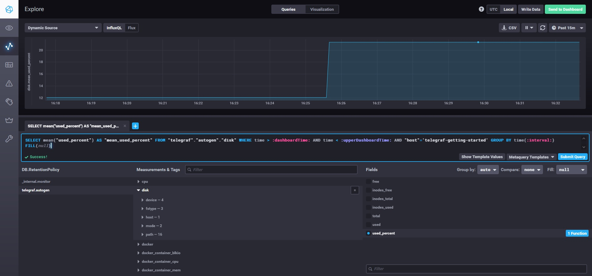
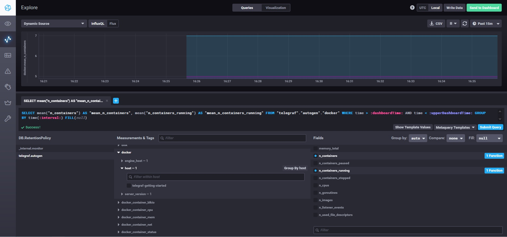
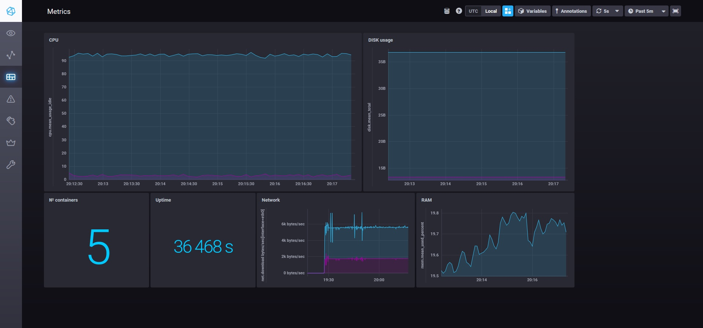

# Домашнее задание к занятию "10.02. Системы мониторинга"

## Обязательные задания

### 1. Опишите основные плюсы и минусы pull и push систем мониторинга.

#### Push

Плюсы:

- Не нужно настраивать сервер для получения данных с узла, все настройки производятся на агенте
- Менее затратная передача данных по UDP

Минусы:

- Передача данных в открытом виде
- Потеря данных при недоступности системы мониторинга
- Открытый порт сервера во внешнюю сеть, что не безопасно
- Сервер не контролирует ни частоту отправки данных, ни их объём

#### Pull

Плюсы:
- Сервер может не иметь открытого порта во внешнюю сеть
- Сервер запрашивает только необходимые метрики, в нужном объеме и с нужной периодичностью
- Защищенный трафик SSL или TLS, контроль подлинности данных

Минусы:
- Необходимо перенастраивть сервер для сбора метрик с каждого нового узла
- Передача данных по HTTP/S ресурсоемкая

### 2. Какие из ниже перечисленных систем относятся к push модели, а какие к pull? А может есть гибридные?

| Система | Модель |
| - | - |
| Prometheus  | Pull (Push с Pushgateway)|
| TICK | Push |
| Zabbix | Push (Pull с Zabbix Proxy) |
| VictoriaMetrics | Push/Pull |
| Nagios | Pull |

### 3. Склонируйте себе [репозиторий](https://github.com/influxdata/sandbox/tree/master) и запустите TICK-стэк, используя технологии docker и docker-compose.

#### В виде решения на это упражнение приведите выводы команд с вашего компьютера (виртуальной машины)

> - curl http://localhost:8086/ping
> - curl http://localhost:8888
> - curl http://localhost:9092/kapacitor/v1/ping
>
> P.S.: если при запуске некоторые контейнеры будут падать с ошибкой - проставьте им режим `Z`, например `./data:/var/lib:Z`

```bash
root@vagrant:/home/vagrant/mnt-hmwrk/tick/sandbox# curl http://localhost:8086/ping -v
*   Trying ::1:8086...
* TCP_NODELAY set
* Connected to localhost (::1) port 8086 (#0)
> GET /ping HTTP/1.1
> Host: localhost:8086
> User-Agent: curl/7.68.0
> Accept: */*
> 
* Mark bundle as not supporting multiuse
< HTTP/1.1 204 No Content
< Content-Type: application/json
< Request-Id: ab10b327-d20f-11ec-897f-0242ac1b0003
< X-Influxdb-Build: OSS
< X-Influxdb-Version: 1.8.10
< X-Request-Id: ab10b327-d20f-11ec-897f-0242ac1b0003
< Date: Thu, 12 May 2022 16:22:07 GMT
< 
* Connection #0 to host localhost left intact
```
```bash
root@vagrant:/home/vagrant/mnt-hmwrk/tick/sandbox# curl http://localhost:8888
<!DOCTYPE html><html><head><meta http-equiv="Content-type" content="text/html; charset=utf-8"><title>Chronograf</title><link rel="icon shortcut" href="/favicon.fa749080.ico"><link rel="stylesheet" href="/src.9cea3e4e.css"></head><body> <div id="react-root" data-basepath=""></div> <script src="/src.a969287c.js"></script> </body></html>
```
```bash
root@vagrant:/home/vagrant/mnt-hmwrk/tick/sandbox# curl http://localhost:9092/kapacitor/v1/ping -v
*   Trying ::1:9092...
* TCP_NODELAY set
* Connected to localhost (::1) port 9092 (#0)
> GET /kapacitor/v1/ping HTTP/1.1
> Host: localhost:9092
> User-Agent: curl/7.68.0
> Accept: */*
> 
* Mark bundle as not supporting multiuse
< HTTP/1.1 204 No Content
< Content-Type: application/json; charset=utf-8
< Request-Id: e98a6230-d20f-11ec-83f5-000000000000
< X-Kapacitor-Version: 1.6.4
< Date: Thu, 12 May 2022 16:23:52 GMT
< 
* Connection #0 to host localhost left intact
```

#### А также скриншот веб-интерфейса ПО chronograf (`http://localhost:8888`). 



### 4. Перейдите в веб-интерфейс Chronograf (`http://localhost:8888`) и откройте вкладку `Data explorer`.

<details><summary>Детали</summary>

> - Нажмите на кнопку `Add a query`
> - Изучите вывод интерфейса и выберите БД `telegraf.autogen`
> - В `measurments` выберите mem->host->telegraf_container_id , а в `fields` выберите used_percent. 
> Внизу появится график утилизации оперативной памяти в контейнере telegraf.
> - Вверху вы можете увидеть запрос, аналогичный SQL-синтаксису. 
> Поэкспериментируйте с запросом, попробуйте изменить группировку и интервал наблюдений.
> 
> Для выполнения задания приведите скриншот с отображением метрик утилизации места на диске (disk->host->telegraf_container_id) из веб-интерфейса.

</details>

#### Для выполнения задания приведите скриншот с отображением метрик утилизации места на диске (disk->host->telegraf_container_id) из веб-интерфейса.


### 5. Изучите список [telegraf inputs](https://github.com/influxdata/telegraf/tree/master/plugins/inputs). 

<details><summary>Детали</summary>

> Добавьте в конфигурацию telegraf следующий плагин - [docker](https://github.com/influxdata/telegraf/tree/master/plugins/inputs/docker):
> 
> ```
> [[inputs.docker]]
>   endpoint = "unix:///var/run/docker.sock"
> ```
> 
> Дополнительно вам может потребоваться донастройка контейнера telegraf в `docker-compose.yml` дополнительного volume и 
> режима privileged:
> ```
>   telegraf:
>     image: telegraf:1.4.0
>     privileged: true
>     volumes:
>       - ./etc/telegraf.conf:/etc/telegraf/telegraf.conf:Z
>       - /var/run/docker.sock:/var/run/docker.sock:Z
>     links:
>       - influxdb
>     ports:
>       - "8092:8092/udp"
>       - "8094:8094"
>       - "8125:8125/udp"
> ```
> 
> После настройке перезапустите telegraf, обновите веб интерфейс и приведите скриншотом список `measurments` в веб-интерфейсе базы telegraf.autogen . Там должны появиться метрики, связанные с docker.
> 
> Факультативно можете изучить какие метрики собирает telegraf после выполнения данного задания.

Потребовалось добавить ещё пользователя, который владеет сокетом:
```bash
$ stat -c '%g' /var/run/docker.sock
1001
```
```yml
...
    privileged: true
    # https://github.com/influxdata/telegraf/issues/10050
    user: telegraf:1001
...
```

</details>

#### приведите скриншотом список `measurments` в веб-интерфейсе базы telegraf.autogen . Там должны появиться метрики, связанные с docker.



## Дополнительное задание (со звездочкой*) - необязательно к выполнению

<!-- <details><summary>.</summary> -->

> В веб-интерфейсе откройте вкладку `Dashboards`. Попробуйте создать свой dashboard с отображением:
> 
> - утилизации ЦПУ
> - количества использованного RAM
> - утилизации пространства на дисках
> - количество поднятых контейнеров
> - аптайм
> - ...
> - фантазируйте)

