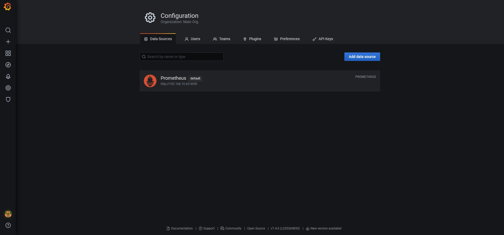
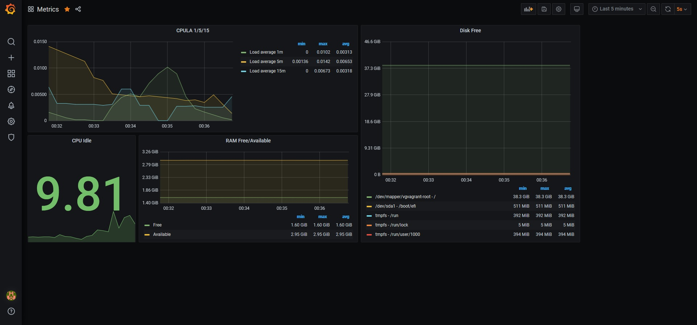
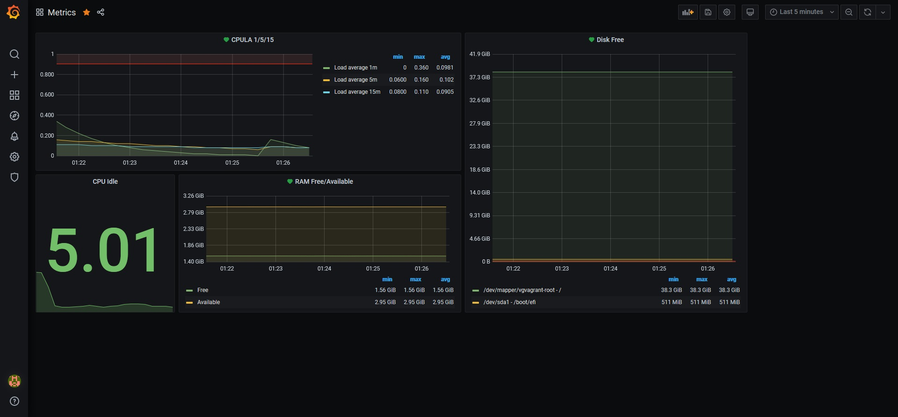

# Домашнее задание к занятию "10.03. Grafana"

## Обязательные задания

### Задание 1
> Используя директорию [help](./help) внутри данного домашнего задания - запустите связку prometheus-grafana.
>
> Зайдите в веб-интерфейс графана, используя авторизационные данные, указанные в манифесте docker-compose.
> 
> Подключите поднятый вами prometheus как источник данных.
> 
> Решение домашнего задания - скриншот веб-интерфейса grafana со списком подключенных Datasource.
> 


## Задание 2
> Изучите самостоятельно ресурсы:
> - [promql-for-humans](https://timber.io/blog/promql-for-humans/#cpu-usage-by-instance)
> - [understanding prometheus cpu metrics](https://www.robustperception.io/understanding-machine-cpu-usage)
> 
> Создайте Dashboard и в ней создайте следующие Panels:
> - Утилизация CPU для nodeexporter (в процентах, 100-idle)
> - CPULA 1/5/15
> - Количество свободной оперативной памяти
> - Количество места на файловой системе
> 
> Для решения данного ДЗ приведите promql запросы для выдачи этих метрик, а также скриншот получившейся Dashboard.
```
(1 - avg by(instance)(rate(node_cpu_seconds_total{job="nodeexporter",mode="idle"}[$__rate_interval]))) * 100
```
```
node_load1{job="nodeexporter"}
node_load5{job="nodeexporter"}
node_load15{job="nodeexporter"}
```
```
avg(node_memory_MemFree_bytes{instance="nodeexporter:9100",job="nodeexporter"})
avg(node_memory_MemAvailable_bytes{instance="nodeexporter:9100", job="nodeexporter"})
```
```
node_filesystem_free_bytes{instance="nodeexporter:9100",job="nodeexporter",device!~'rootfs'}
```



## Задание 3
> Создайте для каждой Dashboard подходящее правило alert (можно обратиться к первой лекции в блоке "Мониторинг").
>
> Для решения ДЗ - приведите скриншот вашей итоговой Dashboard.


## Задание 4
> Сохраните ваш Dashboard.
>
> Для этого перейдите в настройки Dashboard, выберите в боковом меню "JSON MODEL".
>
> Далее скопируйте отображаемое json-содержимое в отдельный файл и сохраните его.
>
> В решении задания - приведите листинг этого файла.

```
{
  "annotations": {
    "list": [
      {
        "builtIn": 1,
        "datasource": "-- Grafana --",
        "enable": true,
        "hide": true,
        "iconColor": "rgba(0, 211, 255, 1)",
        "name": "Annotations & Alerts",
        "type": "dashboard"
      }
    ]
  },
  "editable": true,
  "gnetId": null,
  "graphTooltip": 0,
  "id": 1,
  "links": [],
  "panels": [
    {
      "alert": {
        "alertRuleTags": {},
        "conditions": [
          {
            "evaluator": {
              "params": [
                0.9
              ],
              "type": "gt"
            },
            "operator": {
              "type": "and"
            },
            "query": {
              "params": [
                "A",
                "5m",
                "now"
              ]
            },
            "reducer": {
              "params": [],
              "type": "avg"
            },
            "type": "query"
          }
        ],
        "executionErrorState": "alerting",
        "for": "5m",
        "frequency": "1m",
        "handler": 1,
        "name": "CPULA 1/5/15 alert",
        "noDataState": "no_data",
        "notifications": []
      },
      "aliasColors": {},
      "bars": false,
      "dashLength": 10,
      "dashes": false,
      "datasource": null,
      "fieldConfig": {
        "defaults": {
          "color": {},
          "custom": {},
          "thresholds": {
            "mode": "absolute",
            "steps": []
          },
          "unit": "short"
        },
        "overrides": []
      },
      "fill": 1,
      "fillGradient": 0,
      "gridPos": {
        "h": 8,
        "w": 12,
        "x": 0,
        "y": 0
      },
      "hiddenSeries": false,
      "id": 8,
      "legend": {
        "alignAsTable": true,
        "avg": true,
        "current": false,
        "max": true,
        "min": true,
        "rightSide": true,
        "show": true,
        "total": false,
        "values": true
      },
      "lines": true,
      "linewidth": 1,
      "nullPointMode": "null",
      "options": {
        "alertThreshold": true
      },
      "percentage": false,
      "pluginVersion": "7.4.0",
      "pointradius": 2,
      "points": false,
      "renderer": "flot",
      "seriesOverrides": [],
      "spaceLength": 10,
      "stack": false,
      "steppedLine": false,
      "targets": [
        {
          "expr": "node_load1{job=\"nodeexporter\"}",
          "interval": "",
          "legendFormat": "Load average 1m",
          "refId": "A"
        },
        {
          "expr": "node_load5{job=\"nodeexporter\"}",
          "hide": false,
          "interval": "",
          "legendFormat": "Load average 5m",
          "refId": "B"
        },
        {
          "expr": "node_load15{job=\"nodeexporter\"}",
          "hide": false,
          "interval": "",
          "legendFormat": "Load average 15m",
          "refId": "C"
        }
      ],
      "thresholds": [
        {
          "colorMode": "critical",
          "fill": true,
          "line": true,
          "op": "gt",
          "value": 0.9,
          "visible": true
        }
      ],
      "timeFrom": null,
      "timeRegions": [],
      "timeShift": null,
      "title": "CPULA 1/5/15",
      "tooltip": {
        "shared": true,
        "sort": 0,
        "value_type": "individual"
      },
      "type": "graph",
      "xaxis": {
        "buckets": null,
        "mode": "time",
        "name": null,
        "show": true,
        "values": []
      },
      "yaxes": [
        {
          "$$hashKey": "object:418",
          "format": "short",
          "label": null,
          "logBase": 1,
          "max": "1",
          "min": null,
          "show": true
        },
        {
          "$$hashKey": "object:419",
          "format": "short",
          "label": null,
          "logBase": 1,
          "max": null,
          "min": null,
          "show": true
        }
      ],
      "yaxis": {
        "align": false,
        "alignLevel": null
      }
    },
    {
      "alert": {
        "alertRuleTags": {},
        "conditions": [
          {
            "evaluator": {
              "params": [
                100000000
              ],
              "type": "lt"
            },
            "operator": {
              "type": "and"
            },
            "query": {
              "params": [
                "A",
                "5m",
                "now"
              ]
            },
            "reducer": {
              "params": [],
              "type": "avg"
            },
            "type": "query"
          }
        ],
        "executionErrorState": "alerting",
        "for": "5m",
        "frequency": "1m",
        "handler": 1,
        "message": "Free space is too low",
        "name": "Disk Free alert",
        "noDataState": "no_data",
        "notifications": []
      },
      "aliasColors": {},
      "bars": false,
      "dashLength": 10,
      "dashes": false,
      "datasource": null,
      "fieldConfig": {
        "defaults": {
          "color": {},
          "custom": {},
          "thresholds": {
            "mode": "absolute",
            "steps": []
          }
        },
        "overrides": []
      },
      "fill": 1,
      "fillGradient": 0,
      "gridPos": {
        "h": 16,
        "w": 8,
        "x": 12,
        "y": 0
      },
      "hiddenSeries": false,
      "id": 2,
      "legend": {
        "alignAsTable": true,
        "avg": true,
        "current": false,
        "max": true,
        "min": true,
        "show": true,
        "total": false,
        "values": true
      },
      "lines": true,
      "linewidth": 1,
      "nullPointMode": "null",
      "options": {
        "alertThreshold": true
      },
      "percentage": false,
      "pluginVersion": "7.4.0",
      "pointradius": 2,
      "points": false,
      "renderer": "flot",
      "seriesOverrides": [],
      "spaceLength": 10,
      "stack": false,
      "steppedLine": false,
      "targets": [
        {
          "expr": "node_filesystem_free_bytes{instance=\"nodeexporter:9100\",job=\"nodeexporter\",device!~'rootfs',fstype!='tmpfs'}",
          "interval": "",
          "legendFormat": "{{device}} - {{mountpoint}}",
          "refId": "A"
        }
      ],
      "thresholds": [
        {
          "colorMode": "critical",
          "fill": true,
          "line": true,
          "op": "lt",
          "value": 100000000,
          "visible": true
        }
      ],
      "timeFrom": null,
      "timeRegions": [],
      "timeShift": null,
      "title": "Disk Free",
      "tooltip": {
        "shared": true,
        "sort": 0,
        "value_type": "individual"
      },
      "type": "graph",
      "xaxis": {
        "buckets": null,
        "mode": "time",
        "name": null,
        "show": true,
        "values": []
      },
      "yaxes": [
        {
          "$$hashKey": "object:956",
          "format": "bytes",
          "label": null,
          "logBase": 1,
          "max": null,
          "min": null,
          "show": true
        },
        {
          "$$hashKey": "object:957",
          "format": "short",
          "label": null,
          "logBase": 1,
          "max": null,
          "min": null,
          "show": true
        }
      ],
      "yaxis": {
        "align": false,
        "alignLevel": null
      }
    },
    {
      "datasource": null,
      "fieldConfig": {
        "defaults": {
          "color": {
            "mode": "thresholds"
          },
          "custom": {},
          "mappings": [],
          "thresholds": {
            "mode": "absolute",
            "steps": [
              {
                "color": "green",
                "value": null
              },
              {
                "color": "red",
                "value": 80
              }
            ]
          }
        },
        "overrides": []
      },
      "gridPos": {
        "h": 8,
        "w": 4,
        "x": 0,
        "y": 8
      },
      "id": 6,
      "options": {
        "colorMode": "value",
        "graphMode": "area",
        "justifyMode": "auto",
        "orientation": "auto",
        "reduceOptions": {
          "calcs": [
            "lastNotNull"
          ],
          "fields": "",
          "values": false
        },
        "text": {},
        "textMode": "auto"
      },
      "pluginVersion": "7.4.0",
      "targets": [
        {
          "expr": "(1 - avg by(instance)(rate(node_cpu_seconds_total{job=\"nodeexporter\",mode=\"idle\"}[$__rate_interval]))) * 100",
          "interval": "",
          "legendFormat": "",
          "refId": "A"
        }
      ],
      "title": "CPU Idle",
      "type": "stat"
    },
    {
      "alert": {
        "alertRuleTags": {},
        "conditions": [
          {
            "evaluator": {
              "params": [
                100000000
              ],
              "type": "lt"
            },
            "operator": {
              "type": "and"
            },
            "query": {
              "params": [
                "A",
                "5m",
                "now"
              ]
            },
            "reducer": {
              "params": [],
              "type": "avg"
            },
            "type": "query"
          }
        ],
        "executionErrorState": "alerting",
        "for": "5m",
        "frequency": "1m",
        "handler": 1,
        "message": "Free RAM is too low",
        "name": "RAM Free/Available alert",
        "noDataState": "no_data",
        "notifications": []
      },
      "aliasColors": {},
      "bars": false,
      "dashLength": 10,
      "dashes": false,
      "datasource": null,
      "fieldConfig": {
        "defaults": {
          "color": {},
          "custom": {},
          "thresholds": {
            "mode": "absolute",
            "steps": []
          },
          "unit": "bytes"
        },
        "overrides": []
      },
      "fill": 1,
      "fillGradient": 0,
      "gridPos": {
        "h": 8,
        "w": 8,
        "x": 4,
        "y": 8
      },
      "hiddenSeries": false,
      "id": 4,
      "legend": {
        "alignAsTable": true,
        "avg": true,
        "current": false,
        "max": true,
        "min": true,
        "show": true,
        "total": false,
        "values": true
      },
      "lines": true,
      "linewidth": 1,
      "nullPointMode": "null",
      "options": {
        "alertThreshold": true
      },
      "percentage": false,
      "pluginVersion": "7.4.0",
      "pointradius": 2,
      "points": false,
      "renderer": "flot",
      "seriesOverrides": [],
      "spaceLength": 10,
      "stack": false,
      "steppedLine": false,
      "targets": [
        {
          "expr": "avg(node_memory_MemFree_bytes{instance=\"nodeexporter:9100\",job=\"nodeexporter\"})",
          "interval": "",
          "legendFormat": "Free",
          "refId": "A"
        },
        {
          "expr": "avg(node_memory_MemAvailable_bytes{instance=\"nodeexporter:9100\", job=\"nodeexporter\"})",
          "hide": false,
          "interval": "",
          "legendFormat": "Available",
          "refId": "B"
        }
      ],
      "thresholds": [
        {
          "colorMode": "critical",
          "fill": true,
          "line": true,
          "op": "lt",
          "value": 100000000,
          "visible": true
        }
      ],
      "timeFrom": null,
      "timeRegions": [],
      "timeShift": null,
      "title": "RAM Free/Available",
      "tooltip": {
        "shared": true,
        "sort": 0,
        "value_type": "individual"
      },
      "type": "graph",
      "xaxis": {
        "buckets": null,
        "mode": "time",
        "name": null,
        "show": true,
        "values": []
      },
      "yaxes": [
        {
          "format": "bytes",
          "label": null,
          "logBase": 1,
          "max": null,
          "min": null,
          "show": true
        },
        {
          "format": "short",
          "label": null,
          "logBase": 1,
          "max": null,
          "min": null,
          "show": true
        }
      ],
      "yaxis": {
        "align": false,
        "alignLevel": null
      }
    }
  ],
  "refresh": "",
  "schemaVersion": 27,
  "style": "dark",
  "tags": [],
  "templating": {
    "list": []
  },
  "time": {
    "from": "now-5m",
    "to": "now"
  },
  "timepicker": {},
  "timezone": "",
  "title": "Metrics",
  "uid": "DOh97iunk",
  "version": 22
}
```

